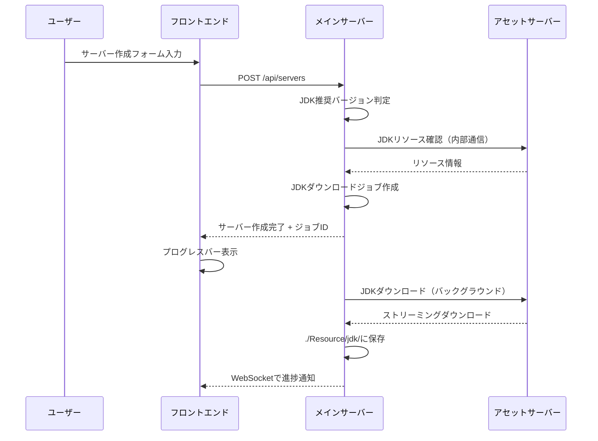
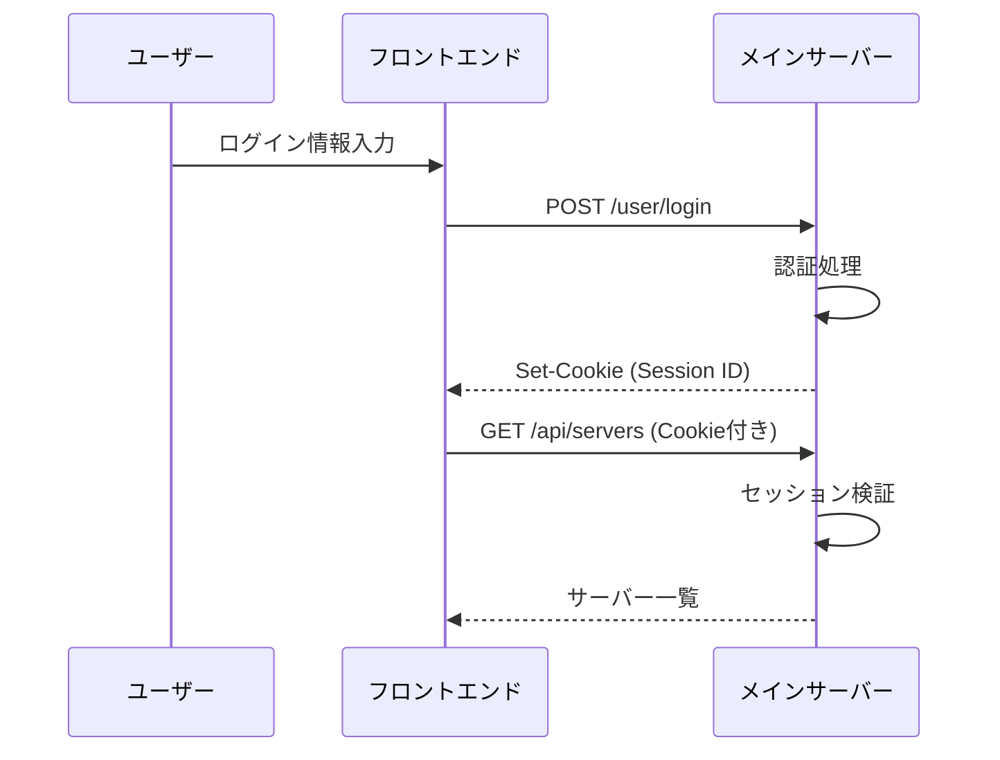

```markdown
# Minecraft Server Manager - Frontend Driver

Minecraftサーバーの構築・管理を簡単に行えるWebベースの管理システムです。JDKの自動インストール、サーバーソフトウェアの管理、プロセス制御などを統合的に提供します。

## 🎯 システム概要

このシステムは、Minecraftサーバーの構築と管理を効率化するために設計された3層アーキテクチャのWebアプリケーションです。

### アーキテクチャ

```
┌─────────────────┐     ┌─────────────────┐     ┌─────────────────┐
│                 │     │                 │     │                 │
│   フロントエンド  │────▶│  メインサーバー   │────▶│ アセットサーバー │
│   (Browser)     │     │  (Port: 12800)  │     │  (Port: 12801)  │
│                 │     │                 │     │                 │
└─────────────────┘     └─────────────────┘     └─────────────────┘
        │                       │                        │
        │                       │                        │
    HTML/JS/CSS          Express + Session         リソース配信
                          認証・API・プロキシ        JDK/サーバー管理
```

### 主要コンポーネント

1. **フロントエンド**: React風のバニラJavaScriptによるSPA
2. **メインサーバー**: Express.jsベースの認証・API・プロキシサーバー
3. **アセットサーバー**: JDKやサーバーソフトウェアのリソース管理サーバー

## 🚀 機能一覧

### 認証・セキュリティ
- ✅ セッションベース認証（express-session）
- ✅ HTTPOnly Cookieによる安全なセッション管理
- ✅ 全APIエンドポイントの認証保護
- ✅ ダウンロード監査ログ

### サーバー管理
- ✅ Minecraftサーバーの作成・編集・削除（CRUD）
- ✅ 複数バージョン対応（1.16.5 〜 1.20.6）
- ✅ 各種サーバーソフトウェア対応
  - Vanilla（公式）
  - Paper（推奨）
  - Spigot
  - Bukkit
  - Mohist（Mod + Plugin）
  - Forge（Mod対応）
  - Fabric（軽量Mod）

### JDK管理
- ✅ 推奨JDKの自動判定
- ✅ JDKの自動ダウンロード・インストール
- ✅ バージョン別JDK管理（8, 11, 17, 21）
- ✅ ダウンロードプログレス表示

### プロセス管理
- ✅ サーバーの起動・停止
- ✅ リアルタイムコンソール出力（WebSocket）
- ✅ コマンド実行
- ✅ ステータス監視

## 📦 インストール

### 前提条件
- Node.js 18.0以上
- npm または yarn
- 2GB以上の空きディスク容量

### セットアップ手順

1. **リポジトリのクローン**
```bash
git clone <repository-url>
cd frontend/middleware/driver
```

2. **依存関係のインストール**
```bash
npm install
```

3. **環境設定（オプション）**
```bash
# .env ファイルを作成
echo "SESSION_SECRET=$(openssl rand -hex 32)" > .env
echo "NODE_ENV=development" >> .env
echo "ASSET_SERVER_URL=http://localhost:12801" >> .env
```

## 🏃 起動方法

### 開発環境

**方法1: 個別起動**
```bash
# ターミナル1: アセットサーバー起動
npm run start:asset

# ターミナル2: メインサーバー起動
npm run dev
```

**方法2: 同時起動**
```bash
npm run dev:all
```

### 本番環境

```bash
# ビルド
npm run build

# PM2での起動（推奨）
pm2 start ecosystem.config.js
```

## 🔌 API仕様

### 認証エンドポイント

| メソッド | パス | 説明 | 認証 |
|---------|------|------|------|
| POST | `/user/signup` | 初回ユーザー登録 | 不要 |
| POST | `/user/login` | ログイン | 不要 |
| GET | `/user/auth` | 認証状態確認 | 不要 |
| POST | `/user/logout` | ログアウト | 必要 |

### サーバー管理API

| メソッド | パス | 説明 | 認証 |
|---------|------|------|------|
| GET | `/api/servers` | サーバー一覧取得 | 必要 |
| POST | `/api/servers` | サーバー作成 | 必要 |
| GET | `/api/servers/:id` | サーバー詳細取得 | 必要 |
| PUT | `/api/servers/:id` | サーバー更新 | 必要 |
| DELETE | `/api/servers/:id` | サーバー削除 | 必要 |
| POST | `/api/servers/:id/start` | サーバー起動 | 必要 |
| POST | `/api/servers/:id/stop` | サーバー停止 | 必要 |
| POST | `/api/servers/:id/command` | コマンド実行 | 必要 |

### JDK管理API

| メソッド | パス | 説明 | 認証 |
|---------|------|------|------|
| GET | `/api/jdks` | インストール済みJDK一覧 | 必要 |
| POST | `/api/jdks/check` | 推奨JDK確認 | 必要 |
| POST | `/api/jdks/download` | JDKダウンロード開始 | 必要 |

### アセットプロキシAPI

| メソッド | パス | 説明 | 認証 |
|---------|------|------|------|
| GET | `/api/assets/resources` | 利用可能リソース一覧 | 必要 |
| GET | `/api/assets/resources/:id` | リソース詳細 | 必要 |
| GET | `/api/assets/download/:type/:file` | ファイルダウンロード | 必要 |

### ジョブ管理API

| メソッド | パス | 説明 | 認証 |
|---------|------|------|------|
| GET | `/api/jobs` | ジョブ一覧 | 必要 |
| GET | `/api/jobs/:id` | ジョブ詳細 | 必要 |
| POST | `/api/jobs/:id/cancel` | ジョブキャンセル | 必要 |

## 🔄 データフロー

### 1. サーバー作成フロー



### 2. 認証フロー



## 📁 ディレクトリ構造

```
driver/
├── index.ts                 # エントリーポイント
├── server/
│   └── asset-server.ts      # アセットサーバー
├── lib/
│   ├── api-router.ts        # APIルーティング
│   ├── middleware-manager.ts # ミドルウェア管理
│   ├── dev-user-manager.ts  # ユーザー管理
│   ├── minecraft-server-manager.ts # サーバー管理
│   ├── minecraft-process-manager.ts # プロセス管理
│   ├── jdk-manager.ts       # JDK管理
│   ├── job-manager.ts       # ジョブ管理
│   ├── ws-server.ts         # WebSocketサーバー
│   ├── frp-manager.ts       # FRP管理（ポート転送）
│   ├── file-browser.ts      # ファイルブラウザ
│   ├── constants.ts         # 定数定義
│   └── types.ts             # 型定義
├── web/
│   ├── index.html           # メインページ
│   ├── demo.html            # デモページ
│   ├── auth.js              # 認証処理
│   ├── app.js               # アプリケーションロジック
│   └── components/
│       └── progress-bar.js  # プログレスバー
├── devsecret/               # 開発用データ（.gitignore）
│   ├── users.json           # ユーザーデータ
│   ├── servers.json         # サーバー設定
│   └── servers_data/        # サーバーデータ
│       └── jdks/            # JDKインストール先
├── dummyfile/               # ダミーファイル（開発用）
├── Resource/                # リソース格納
│   ├── jdk/                 # JDKファイル
│   └── server/              # サーバーファイル
├── package.json
├── tsconfig.json
└── ecosystem.config.js      # PM2設定
```

## 🔧 設定

### セッション設定（`lib/constants.ts`）

```typescript
// セッション設定
export const SESSION_SECRET = process.env.SESSION_SECRET || crypto.randomBytes(64).toString('hex');
export const SESSION_NAME = 'frontdriver-session';

// データディレクトリ
export const DATA_DIR = process.env.DATA_DIR || path.join(DEV_SECRET_DIR, 'servers_data');
export const JDKS_DIR = path.join(DATA_DIR, 'jdks');
```

### アセットサーバー設定

```typescript
const ASSET_PORT = 12801;
const DUMMY_FILES_DIR = path.join(__dirname, '..', 'dummyfile');
```

## 🐛 トラブルシューティング

### よくある問題と解決方法

**Q: アセットサーバーに接続できない**
```bash
# アセットサーバーが起動しているか確認
curl http://localhost:12801/health

# 起動していない場合
npm run start:asset
```

**Q: セッションが維持されない**
```bash
# Cookieが有効か確認（ブラウザの開発者ツール）
# SESSION_SECRETが設定されているか確認
echo $SESSION_SECRET
```

**Q: JDKダウンロードが失敗する**
```bash
# ディレクトリの権限を確認
ls -la ./Resource/jdk/

# 手動でディレクトリを作成
mkdir -p ./Resource/jdk
```

## 🔒 セキュリティ考慮事項

### 実装済みのセキュリティ対策

- ✅ HTTPOnly Cookie（XSS対策）
- ✅ SameSite Cookie（CSRF対策）
- ✅ セッション有効期限（24時間）
- ✅ bcryptによるパスワードハッシュ化
- ✅ 全APIエンドポイントの認証保護
- ✅ ダウンロード監査ログ

### 本番環境での追加推奨事項

1. **HTTPS化**
```nginx
server {
    listen 443 ssl http2;
    ssl_certificate /path/to/cert.pem;
    ssl_certificate_key /path/to/key.pem;
}
```

2. **環境変数の外部化**
```bash
# .env.production
NODE_ENV=production
SESSION_SECRET=<strong-random-string>
MONGODB_URI=mongodb://localhost:27017/minecraft
```

3. **Rate Limiting**
```typescript
import rateLimit from 'express-rate-limit';
const limiter = rateLimit({
    windowMs: 15 * 60 * 1000,
    max: 100
});
```

## 📝 ライセンス

MIT License

## 🤝 貢献

プルリクエストを歓迎します。大きな変更の場合は、まずissueを開いて変更内容を議論してください。

## 📞 サポート

問題が発生した場合は、GitHubのIssueセクションで報告してください。
```