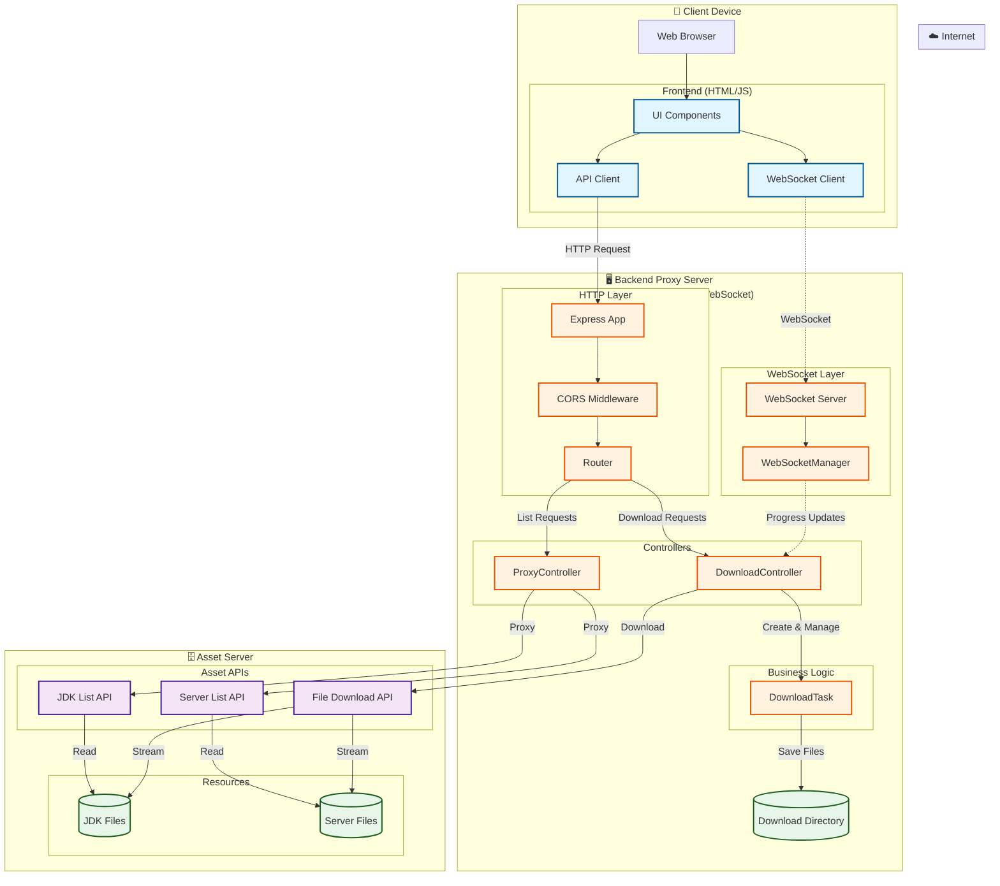

```mermaid
graph TB
    subgraph Internet["☁️ Internet"]
    end

    subgraph ClientDevice["📱 Client Device"]
        Browser[Web Browser]
        
        subgraph Frontend["Frontend (HTML/JS)"]
            UI[UI Components]
            WSClient[WebSocket Client]
            APIClient[API Client]
        end
    end

    subgraph BackendProxy["🖥️ Backend Proxy Server<br/>(Node.js + Express + WebSocket)"]
        subgraph HTTPLayer["HTTP Layer"]
            Express[Express App]
            CORS[CORS Middleware]
            Router[Router]
        end
        
        subgraph WebSocketLayer["WebSocket Layer"]
            WSServer[WebSocket Server]
            WSManager[WebSocketManager]
        end
        
        subgraph Controllers["Controllers"]
            ProxyCtrl[ProxyController]
            DLCtrl[DownloadController]
        end
        
        subgraph BusinessLogic["Business Logic"]
            DLTask[DownloadTask]
        end
        
        DLDir[(Download Directory)]
    end

    subgraph AssetServer["🗄️ Asset Server<br/>(File Distribution)"]
        subgraph AssetAPIs["Asset APIs"]
            ServerAPI[Server List API]
            JDKAPI[JDK List API]
            FileAPI[File Download API]
        end
        
        subgraph Resources["Resources"]
            JDKFiles[(JDK Files)]
            ServerFiles[(Server Files)]
        end
    end

    %% Client connections
    Browser --> UI
    UI --> WSClient
    UI --> APIClient

    %% HTTP connections
    APIClient -->|HTTP Request| Express
    Express --> CORS
    CORS --> Router
    Router -->|List Requests| ProxyCtrl
    Router -->|Download Requests| DLCtrl

    %% WebSocket connections
    WSClient -.->|WebSocket| WSServer
    WSServer --> WSManager
    WSManager -.->|Progress Updates| DLCtrl

    %% Backend to Asset Server
    ProxyCtrl -->|Proxy| ServerAPI
    ProxyCtrl -->|Proxy| JDKAPI
    DLCtrl -->|Download| FileAPI
    DLCtrl -->|Create & Manage| DLTask

    %% Asset Server connections
    ServerAPI -->|Read| ServerFiles
    JDKAPI -->|Read| JDKFiles
    FileAPI -->|Stream| ServerFiles
    FileAPI -->|Stream| JDKFiles

    %% Download storage
    DLTask -->|Save Files| DLDir

    %% Styling
    classDef frontend fill:#e1f5ff,stroke:#01579b,stroke-width:2px
    classDef backend fill:#fff3e0,stroke:#e65100,stroke-width:2px
    classDef asset fill:#f3e5f5,stroke:#4a148c,stroke-width:2px
    classDef storage fill:#e8f5e9,stroke:#1b5e20,stroke-width:2px

    class UI,WSClient,APIClient frontend
    class Express,CORS,Router,WSServer,WSManager,ProxyCtrl,DLCtrl,DLTask backend
    class ServerAPI,JDKAPI,FileAPI asset
    class DLDir,JDKFiles,ServerFiles storage
```