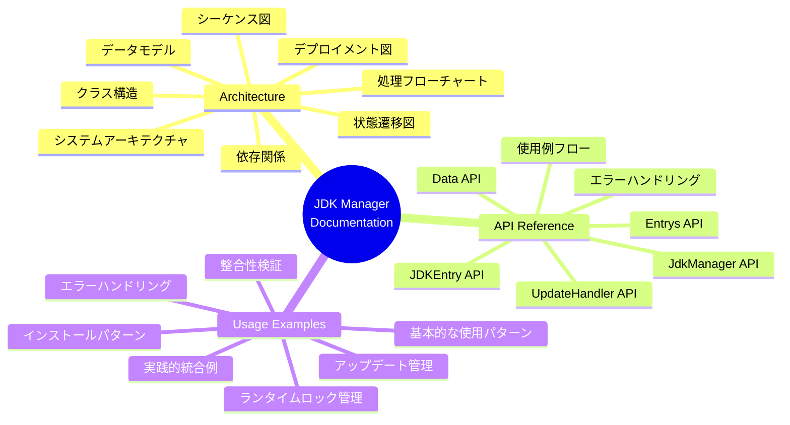

# JDK Manager - Documentation Index

## 📚 ドキュメント一覧

このディレクトリには、JDK Managerシステムの詳細なドキュメントが含まれています。すべてのドキュメントはMermaid図を使用して視覚的に説明されています。

### 📖 ドキュメント構成

---

## 1️⃣ Architecture Documentation

**ファイル**: [architecture.md](./architecture.md)

システム全体のアーキテクチャを図解したドキュメント。

### 📋 内容

- **システムアーキテクチャ概要**
  - 外部システムとの連携
  - 内部コンポーネント構成
  
- **クラス構造**
  - 全クラスの関係図
  - プロパティとメソッド一覧
  
- **データモデル**
  - ERダイアグラム
  - レジストリ構造
  
- **状態遷移図**
  - JDKインスタンスのライフサイクル
  - 検証ステータスの遷移
  
- **シーケンス図**
  - インストールフロー
  - アップデートフロー
  - ファイル整合性検証フロー
  - ランタイムロック管理
  
- **処理フローチャート**
  - インストール処理の詳細
  - ファイル整合性検証
  - アップデートチェック
  
- **コンポーネント間の依存関係**
- **デプロイメント図**
- **タイミング図（ロック機構）**

### 🎯 対象読者

- システムアーキテクト
- 開発者（システム設計を理解したい人）
- 技術リーダー

---

## 2️⃣ API Reference

**ファイル**: [api-reference.md](./api-reference.md)

すべてのAPIの詳細な仕様をMermaid図で説明したリファレンス。

### 📋 内容

- **API階層構造**
  
- **JdkManager API**
  - コンストラクタ
  - プロパティ
  
- **Data API**
  - `init()` - レジストリ初期化
  - `load()` - レジストリ読み込み
  - `save()` - レジストリ保存
  
- **Entrys API**
  - `add()` - JDKインストール
  - `remove()` - JDK削除
  - `getByVersion()` - バージョンで検索
  - `getByStructName()` - 正式名称で検索
  - `getById()` - IDで検索
  - `getInstallList()` - インストール済みリスト取得
  - `updateCheck()` - アップデートチェック
  - `checkFileHealthAll()` - 全JDKの整合性検証
  
- **JDKEntry API**
  - `useRuntime()` - ランタイムロック取得
  - `unUseRuntime()` - ランタイムロック解放
  - `isLocked()` - ロック状態確認
  - `checkFileHealth()` - ファイル整合性検証
  - `getUpdate()` - アップデートハンドラ取得
  - 各種ゲッターメソッド
  
- **UpdateHandler API**
  - `install()` - アップデート実行
  - `getNewVersionInfo()` - 新バージョン情報取得
  
- **エラーハンドリング**
  - Result型のフロー
  - エラーメッセージ一覧
  
- **使用例フロー**

### 🎯 対象読者

- 開発者（API使用方法を知りたい人）
- API統合担当者
- テストエンジニア

---

## 3️⃣ Usage Examples

**ファイル**: [usage-examples.md](./usage-examples.md)

実践的な使用例とパターンをMermaid図で説明したガイド。

### 📋 内容

- **基本的な使用パターン**
  - 初回セットアップ
  - 既存レジストリの読み込み
  
- **JDKインストールのパターン**
  - シンプルなインストール
  - カスタム名称でのインストール
  - 複数バージョンのインストール
  
- **ランタイムロックのパターン**
  - 基本的なロック管理
  - 複数アプリケーションからの使用
  
- **ファイル整合性検証のパターン**
  - 起動時の一括検証
  - 個別JDKの検証
  - 定期的なバックグラウンド検証
  
- **アップデート管理のパターン**
  - アップデートチェックとインストール
  - 個別JDKのアップデート
  
- **エラーハンドリングのパターン**
  - Result型の使用例
  - エラーごとの対応フロー
  
- **実践的な統合例**
  - Minecraftランチャーとの統合
  - 自動メンテナンスシステム
  
- **ドライランモードの使用**

### 🎯 対象読者

- 開発者（実装例を知りたい人）
- アプリケーション統合担当者
- 初めてシステムを使う人

---

## 📊 ドキュメントの読み方

### 初めての方

1. **[Usage Examples](./usage-examples.md)** から始める
   - 基本的な使用パターンを理解
   - 簡単な統合例を確認

2. **[API Reference](./api-reference.md)** で詳細を確認
   - 必要なAPIの仕様を参照
   - パラメータと戻り値を確認

3. **[Architecture](./architecture.md)** で全体像を把握
   - システムの内部構造を理解
   - より高度な使い方を検討

### システム設計者の方

1. **[Architecture](./architecture.md)** から始める
   - システム全体の設計を理解
   - クラス構造と依存関係を確認

2. **[API Reference](./api-reference.md)** で詳細を確認
   - 各APIの責任範囲を理解
   - エラーハンドリング戦略を確認

3. **[Usage Examples](./usage-examples.md)** で実装例を参照
   - 推奨パターンを確認
   - 統合ポイントを検討

### 既存コードを保守する方

1. **[Architecture](./architecture.md)** でシステムを理解
   - 処理フローを確認
   - 各コンポーネントの役割を把握

2. **[API Reference](./api-reference.md)** で仕様を確認
   - 変更が必要な部分のAPIを理解
   - 影響範囲を確認

3. **[Usage Examples](./usage-examples.md)** でパターンを確認
   - 既存の使用例と比較
   - ベストプラクティスを適用

---

## 🔗 関連リンク

- [README.md](../README.md) - プロジェクト概要と基本的な使い方
- [仕様書.md](../仕様書.md) - 詳細な設計仕様書（テキスト形式）
- [GitHub Repository](https://github.com/suke0930/sotuken)

---

## 📝 ドキュメントの表記について

### Mermaid図の凡例

#### フローチャート
- 🔵 青色: 開始・入力
- 🟢 緑色: 成功・完了
- 🔴 赤色: エラー・失敗
- 🟡 黄色: 警告・特殊処理

#### シーケンス図
- `participant`: システムコンポーネント
- `Note over`: 処理の説明
- `alt/else`: 条件分岐
- `loop`: 繰り返し処理
- `rect`: グループ化

#### クラス図
- `+`: public メソッド/プロパティ
- `-`: private メソッド/プロパティ
- `*--`: 合成関係
- `-->`: 依存関係
- `..>`: 使用関係

---

**最終更新**: 2025-10-21  
**バージョン**: 1.0.0
