# JDK Manager - API Reference (Mermaid Edition)

## API階層構造

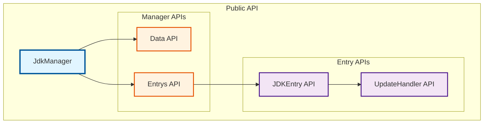

## JdkManager API

### コンストラクタ

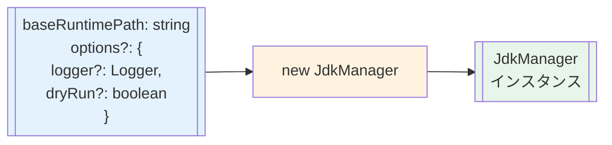

### プロパティ

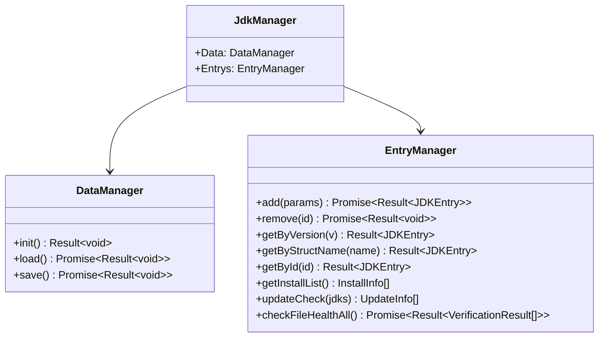

## Data API

### init() - レジストリ初期化

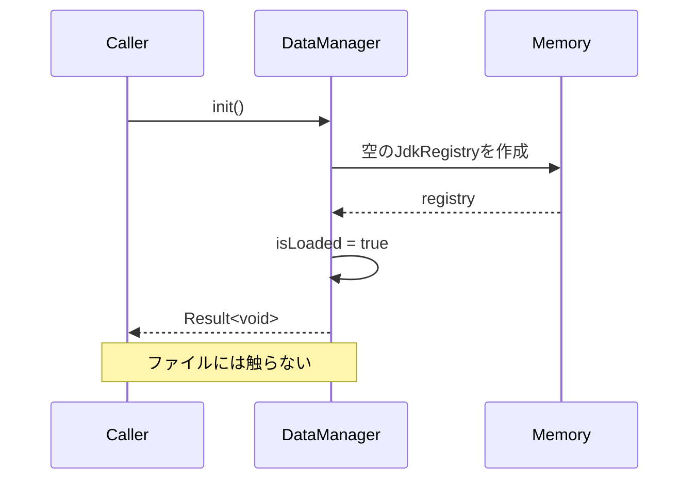

**戻り値:**
```typescript
Result<void>
```

### load() - レジストリ読み込み

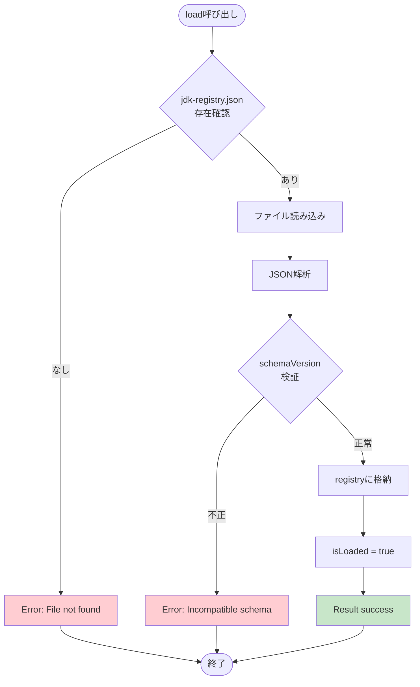

**戻り値:**
```typescript
Promise<Result<void>>
```

### save() - レジストリ保存

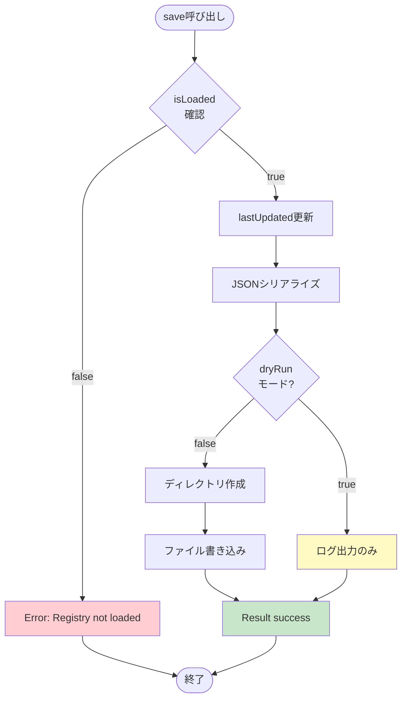

**戻り値:**
```typescript
Promise<Result<void>>
```

## Entrys API

### add() - JDKインストール

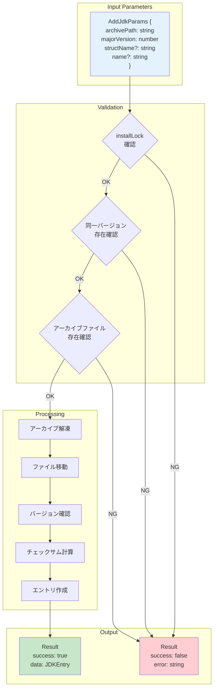

**シグネチャ:**
```typescript
async add(params: AddJdkParams): Promise<Result<JDKEntry>>
```

### remove() - JDK削除

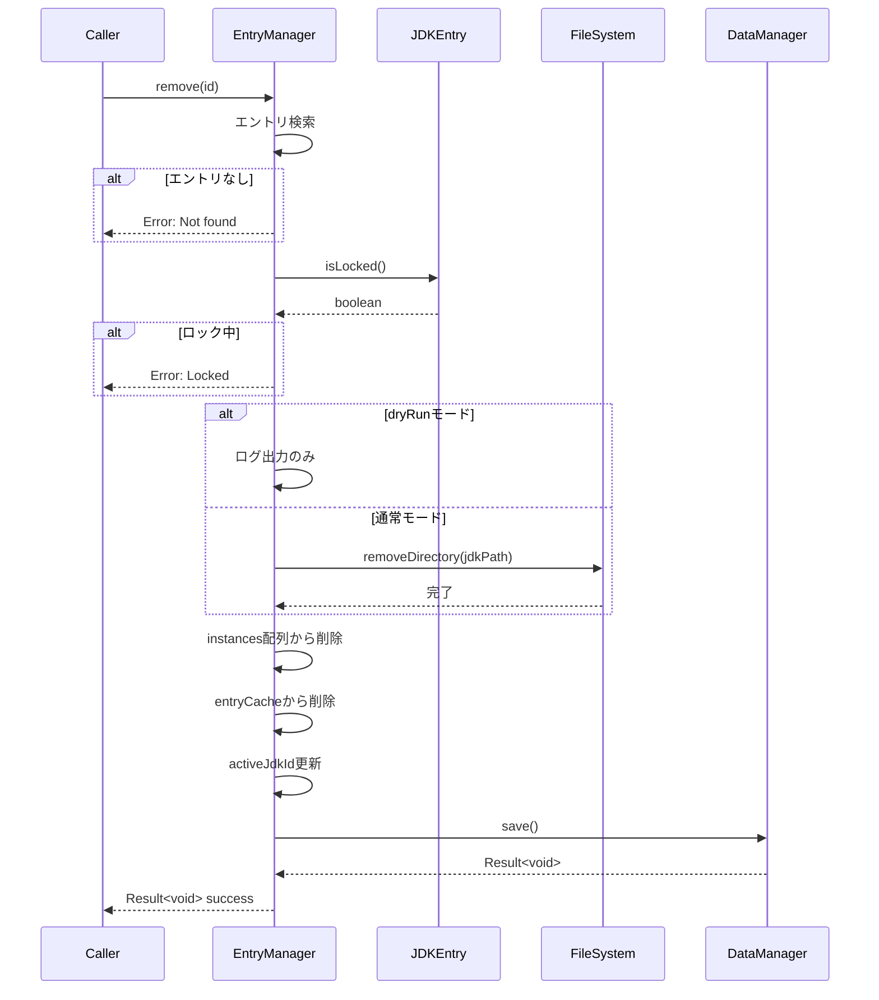

**シグネチャ:**
```typescript
async remove(id: string): Promise<Result<void>>
```

### getByVersion() - バージョンで検索


**シグネチャ:**
```typescript
getByVersion(majorVersion: number): Result<JDKEntry>
```

### getByStructName() - 正式名称で検索

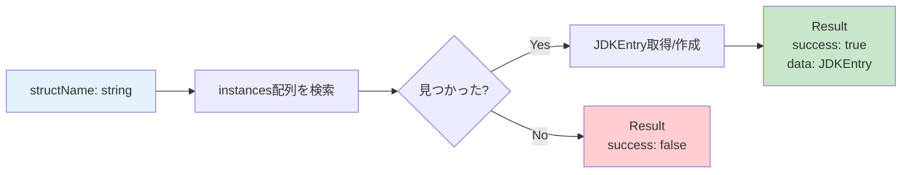

**シグネチャ:**
```typescript
getByStructName(structName: string): Result<JDKEntry>
```

### getById() - IDで検索

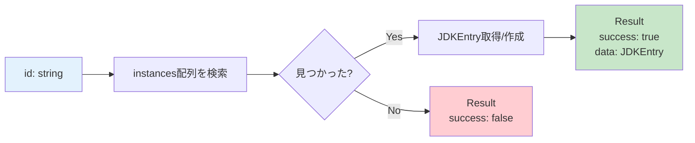

**シグネチャ:**
```typescript
getById(id: string): Result<JDKEntry>
```

### getInstallList() - インストール済みリスト取得

```mermaid
flowchart TD
    Start([getInstallList]) --> Loop{全instances<br/>処理完了?}
    Loop -->|No| Extract[必要な情報を抽出]
    Extract --> Create[InstallInfo作成]
    Create --> Add[配列に追加]
    Add --> Loop
    Loop -->|Yes| Return[InstallInfo[]返却]
    
    style Start fill:#e3f2fd
    style Return fill:#c8e6c9
```

**戻り値:**
```typescript
InstallInfo[] = {
  id: string;
  majorVersion: number;
  name: string;
  structName: string;
  verificationStatus: VerificationStatus;
}[]
```

### updateCheck() - アップデートチェック

```mermaid
graph TD
    Input["availableJdks:<br/>AvailableJdk[]"] --> GetOS[現在のOS判定]
    GetOS --> Init[updates配列初期化]
    
    Init --> Loop{全instances<br/>処理}
    
    Loop --> Find[availableJdksから<br/>同じバージョン検索]
    Find --> Match{マッチ?}
    
    Match -->|No| Loop
    Match -->|Yes| GetDL[OS対応<br/>ダウンロードURL取得]
    
    GetDL --> Exists{URL存在?}
    Exists -->|No| Loop
    Exists -->|Yes| Compare{structName<br/>比較}
    
    Compare -->|同じ| Loop
    Compare -->|異なる| AddUpdate[UpdateInfo作成<br/>配列に追加]
    
    AddUpdate --> Loop
    Loop --> Return[UpdateInfo[]返却]
    
    style Input fill:#e3f2fd
    style Return fill:#c8e6c9
```

**戻り値:**
```typescript
UpdateInfo[] = {
  id: string;
  currentStructName: string;
  availableStructName: string;
  downloadUrl: string;
  majorVersion: number;
}[]
```

### checkFileHealthAll() - 全JDKの整合性検証

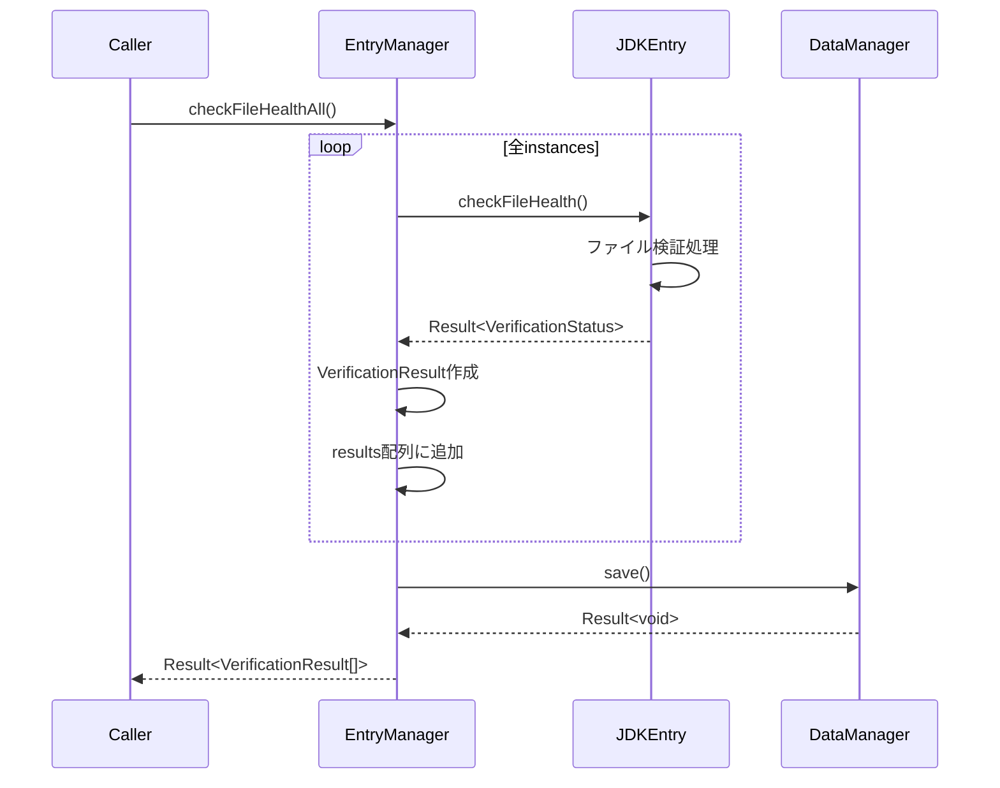

**戻り値:**
```typescript
Promise<Result<VerificationResult[]>>

VerificationResult = {
  id: string;
  status: VerificationStatus;
  missingFiles?: string[];
  corruptedFiles?: string[];
}
```

## JDKEntry API

### メソッド一覧

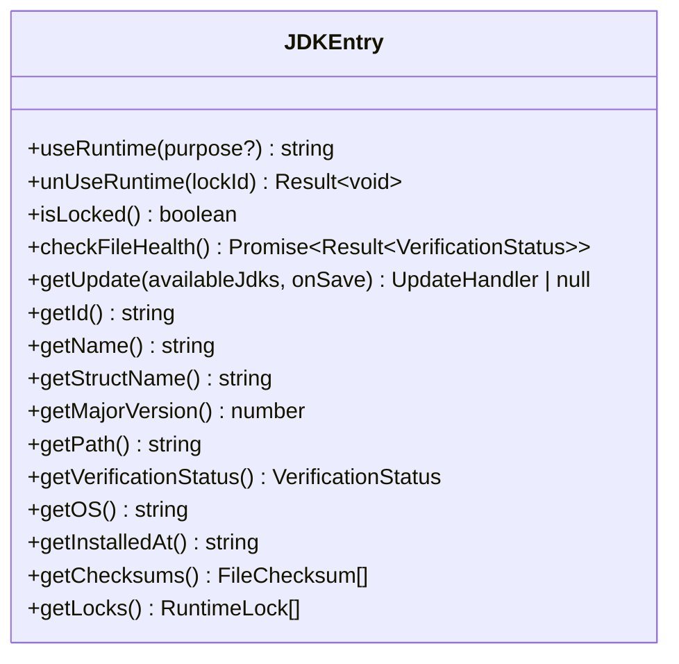

### useRuntime() - ランタイムロック取得

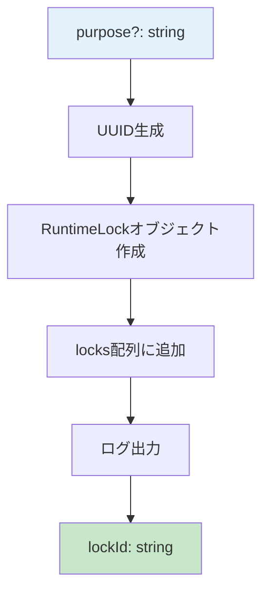

**シグネチャ:**
```typescript
useRuntime(purpose?: string): string
```

### unUseRuntime() - ランタイムロック解放

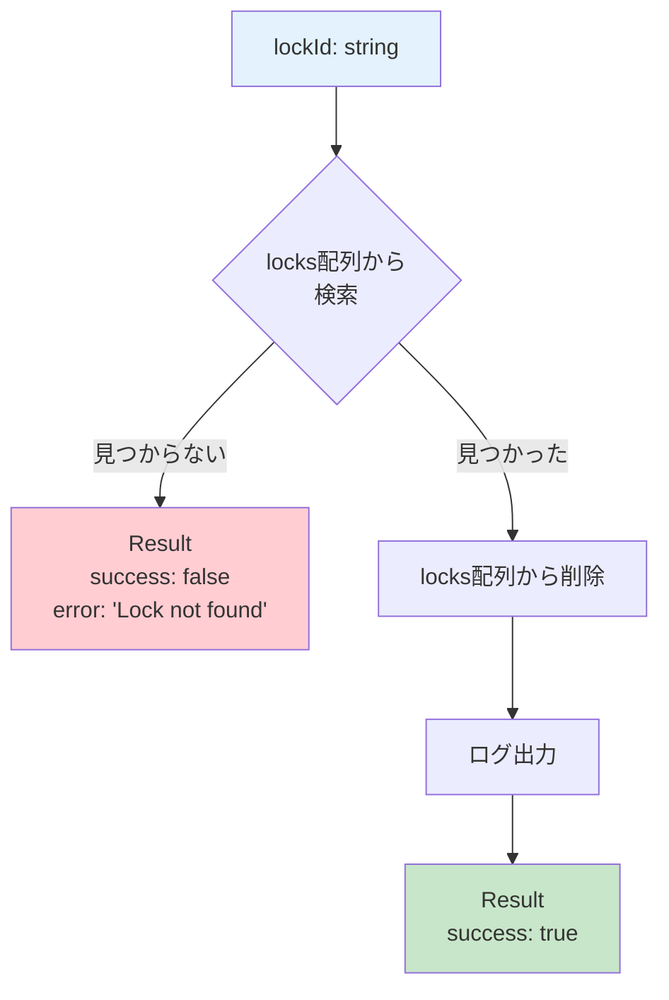

**シグネチャ:**
```typescript
unUseRuntime(lockId: string): Result<void>
```

### isLocked() - ロック状態確認

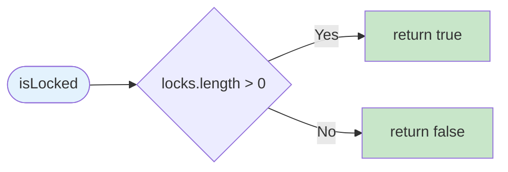

**シグネチャ:**
```typescript
isLocked(): boolean
```

### checkFileHealth() - ファイル整合性検証

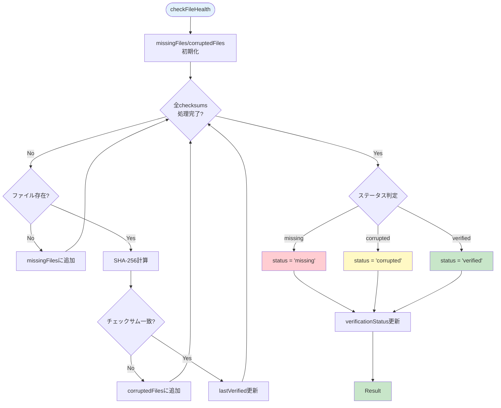

**シグネチャ:**
```typescript
async checkFileHealth(): Promise<Result<VerificationStatus>>
```

### getUpdate() - アップデートハンドラ取得

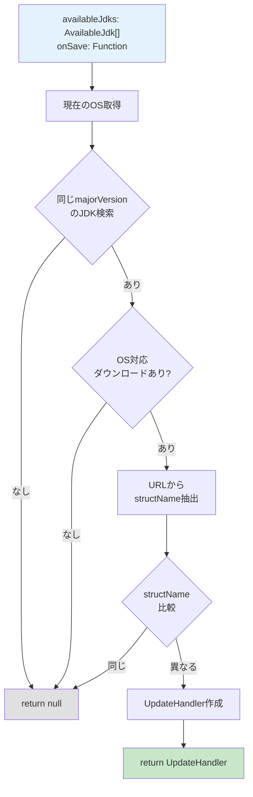

**シグネチャ:**
```typescript
getUpdate(
  availableJdks: AvailableJdk[],
  onSaveRegistry: () => Promise<Result<void>>
): UpdateHandler | null
```

### ゲッターメソッド

```mermaid
graph LR
    subgraph "Getters"
        getId[getId]
        getName[getName]
        getStructName[getStructName]
        getMajorVersion[getMajorVersion]
        getPath[getPath]
        getVerificationStatus[getVerificationStatus]
        getOS[getOS]
        getInstalledAt[getInstalledAt]
        getChecksums[getChecksums]
        getLocks[getLocks]
    end
    
    subgraph "Internal Data"
        Instance[instance: JdkInstance]
        Locks[locks: RuntimeLock[]]
        BasePath[baseRuntimePath: string]
    end
    
    Instance --> getId
    Instance --> getName
    Instance --> getStructName
    Instance --> getMajorVersion
    Instance --> getVerificationStatus
    Instance --> getOS
    Instance --> getInstalledAt
    Instance --> getChecksums
    
    Locks --> getLocks
    BasePath --> getPath
    Instance --> getPath
    
    style Instance fill:#e3f2fd
    style Locks fill:#e3f2fd
    style BasePath fill:#e3f2fd
```

## UpdateHandler API

### install() - アップデート実行

```mermaid
sequenceDiagram
    participant Caller
    participant UH as UpdateHandler
    participant Entry as JDKEntry
    participant FS as FileSystem
    
    Caller->>UH: install(archivePath, dryRun?)
    
    UH->>Entry: isLocked()
    Entry-->>UH: boolean
    
    alt ロック中
        UH-->>Caller: Error: Locked
    end
    
    alt dryRunモード
        UH->>UH: ログ出力のみ
        UH-->>Caller: Success
    end
    
    UH->>UH: レジストリバックアップ
    UH->>FS: moveDirectory(jdk, backup)
    
    Note over UH,FS: 新バージョンインストール
    
    alt インストール失敗
        UH->>FS: ロールバック処理
        UH-->>Caller: Error
    end
    
    UH->>Entry: instance更新
    UH->>UH: onSaveRegistry()
    UH->>FS: クリーンアップ
    
    UH-->>Caller: Success
```

**シグネチャ:**
```typescript
async install(
  archivePath: string,
  dryRun?: boolean
): Promise<Result<void>>
```

### getNewVersionInfo() - 新バージョン情報取得

```mermaid
flowchart LR
    Call([getNewVersionInfo]) --> Return["return {<br/>structName: string<br/>downloadUrl: string<br/>version: string<br/>vendor?: string<br/>}"]
    
    style Call fill:#e3f2fd
    style Return fill:#c8e6c9
```

**シグネチャ:**
```typescript
getNewVersionInfo(): {
  structName: string;
  downloadUrl: string;
  version: string;
  vendor?: string;
}
```

## エラーハンドリング

### Result型のフロー

```mermaid
flowchart TD
    Start([API呼び出し]) --> Try[try-catchで実行]
    
    Try --> Success{成功?}
    Success -->|Yes| ReturnSuccess["return {<br/>success: true<br/>data: T<br/>}"]
    Success -->|No| CatchError[Errorをキャッチ]
    
    CatchError --> ReturnError["return {<br/>success: false<br/>error: string<br/>}"]
    
    style Start fill:#e3f2fd
    style ReturnSuccess fill:#c8e6c9
    style ReturnError fill:#ffcdd2
```

### エラーメッセージの例

```mermaid
mindmap
  root((Error Messages))
    Installation
      JDK with major version X already exists
      Installation is already in progress
      Archive file not found
      Failed to verify Java version
      Version mismatch
    Removal
      JDK not found
      Entry is locked and cannot be removed
      Failed to remove directory
    Verification
      Failed to calculate checksum
      Failed to read file
    Lock Management
      Lock not found
    Data Management
      Registry not loaded
      Registry file not found
      Incompatible schema version
      Failed to save registry
```

## 使用例フロー

### 基本的な使用例

```mermaid
sequenceDiagram
    actor User
    participant App
    participant Manager as JdkManager
    participant Entrys as EntryManager
    participant Entry as JDKEntry
    
    User->>App: JDK管理システム起動
    App->>Manager: new JdkManager(path, options)
    Manager-->>App: manager
    
    App->>Manager: Data.init()
    Manager-->>App: Result<void>
    
    User->>App: Java 17インストール要求
    App->>Entrys: add({archivePath, majorVersion: 17})
    Entrys->>Entrys: インストール処理
    Entrys-->>App: Result<JDKEntry>
    
    App->>Manager: Entrys.getInstallList()
    Manager-->>App: InstallInfo[]
    App-->>User: インストール済みリスト表示
    
    User->>App: Java 17使用開始
    App->>Entrys: getByVersion(17)
    Entrys-->>App: Result<JDKEntry>
    
    App->>Entry: useRuntime("Minecraft")
    Entry-->>App: lockId
    
    Note over App,Entry: Minecraftプレイ中...
    
    App->>Entry: unUseRuntime(lockId)
    Entry-->>App: Result<void>
    
    User->>App: 整合性チェック要求
    App->>Manager: Entrys.checkFileHealthAll()
    Manager-->>App: Result<VerificationResult[]>
    App-->>User: 検証結果表示
```

---

**このドキュメントは、JDK Manager APIの包括的なリファレンスをMermaid図で提供します。**
