# JDK Manager - Architecture Documentation

## システムアーキテクチャ概要

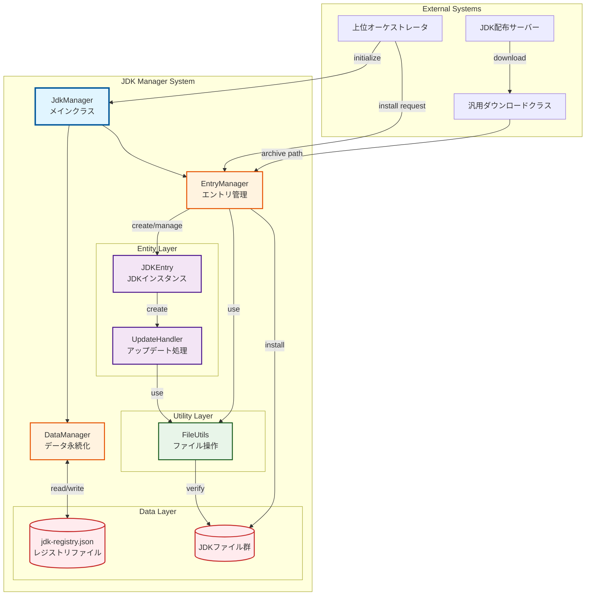

## クラス構造

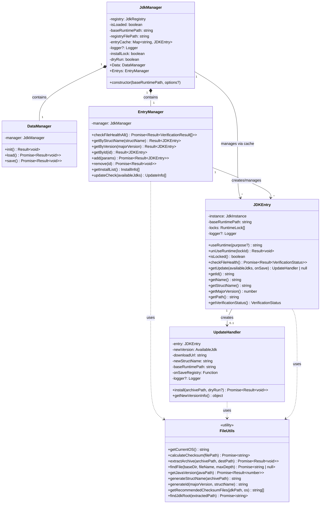

## データモデル

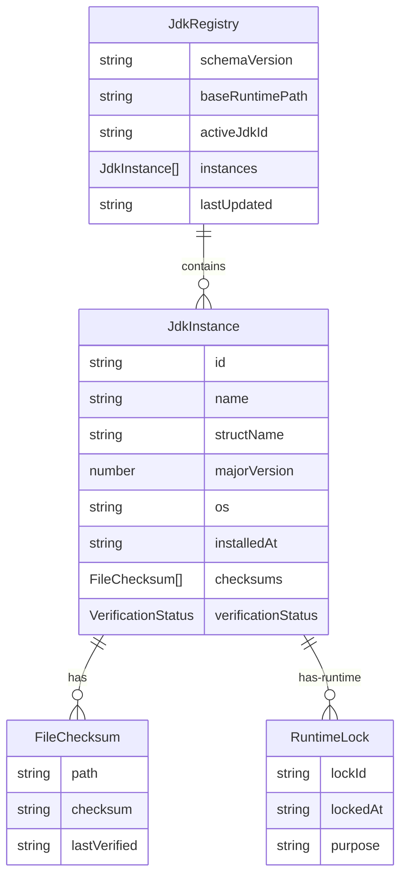

## 状態遷移図

### JDKインスタンスのライフサイクル

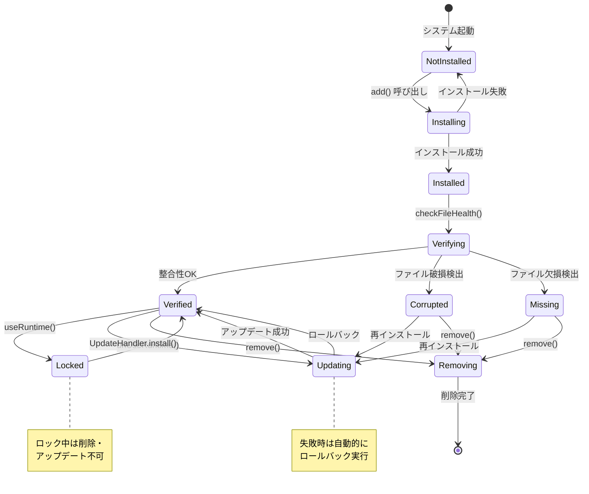

### 検証ステータスの遷移

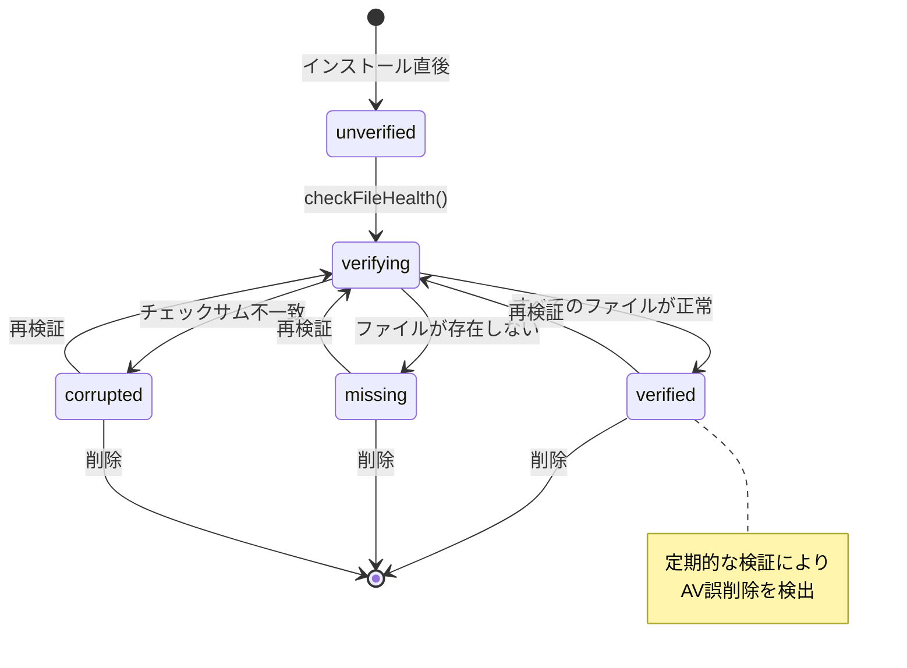

## シーケンス図

### インストールフロー

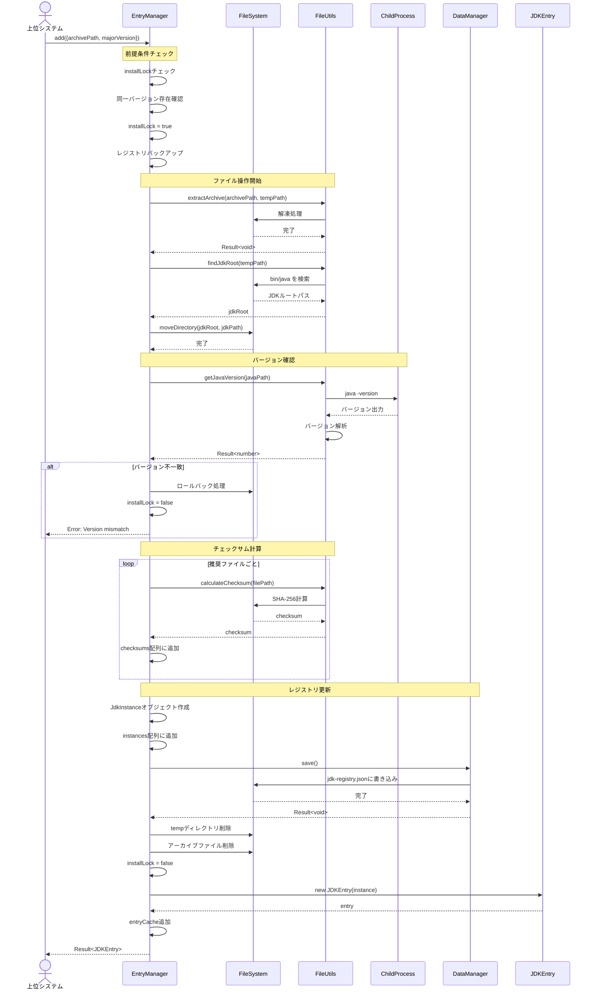

### アップデートフロー

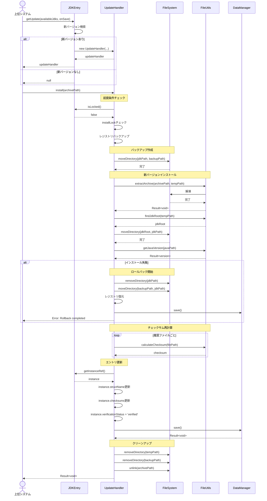

### ファイル整合性検証フロー

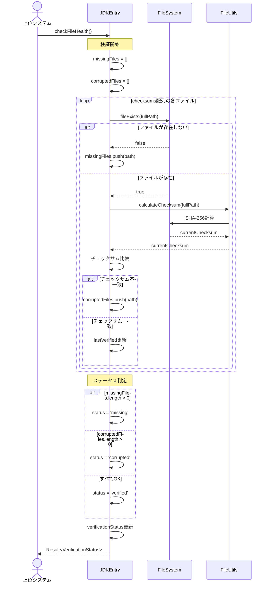

### ランタイムロック管理

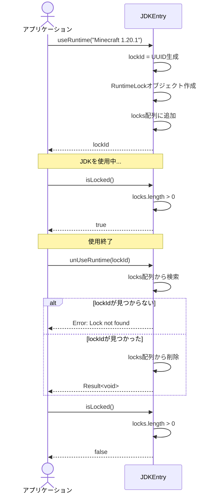

## 処理フローチャート

### インストール処理の詳細フロー

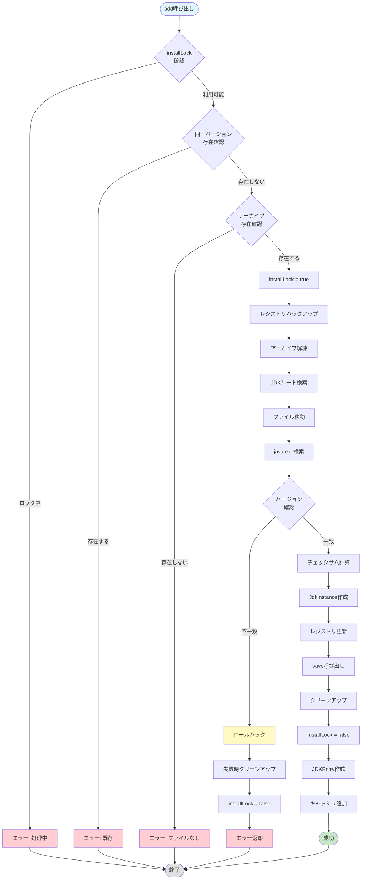

### ファイル整合性検証フロー

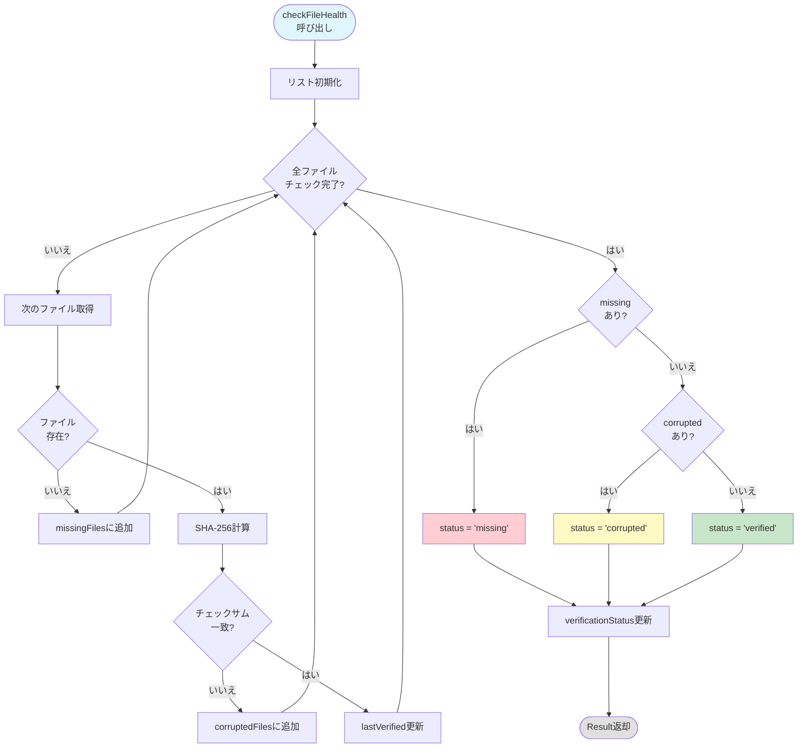

### アップデートチェックフロー

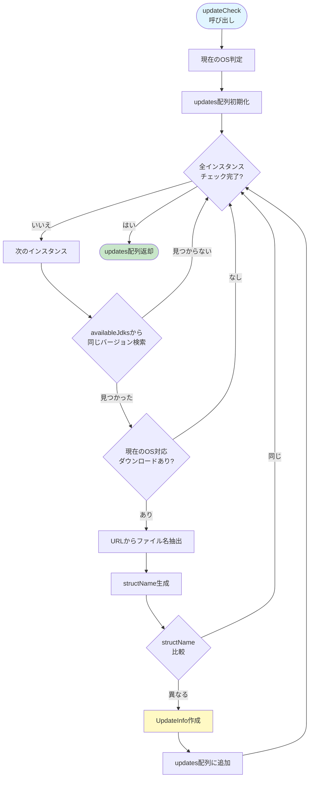

## コンポーネント間の依存関係

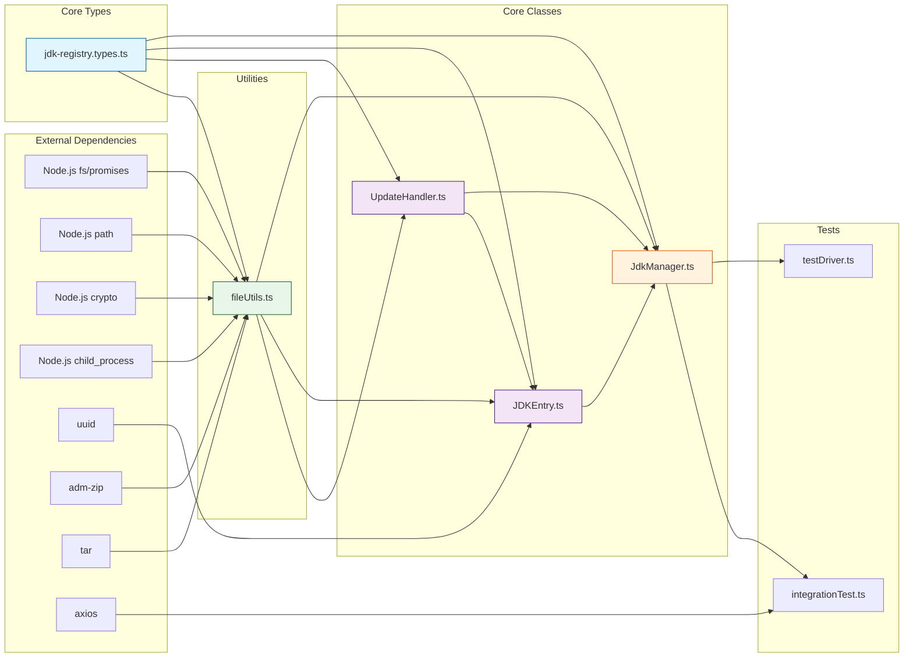

## デプロイメント図

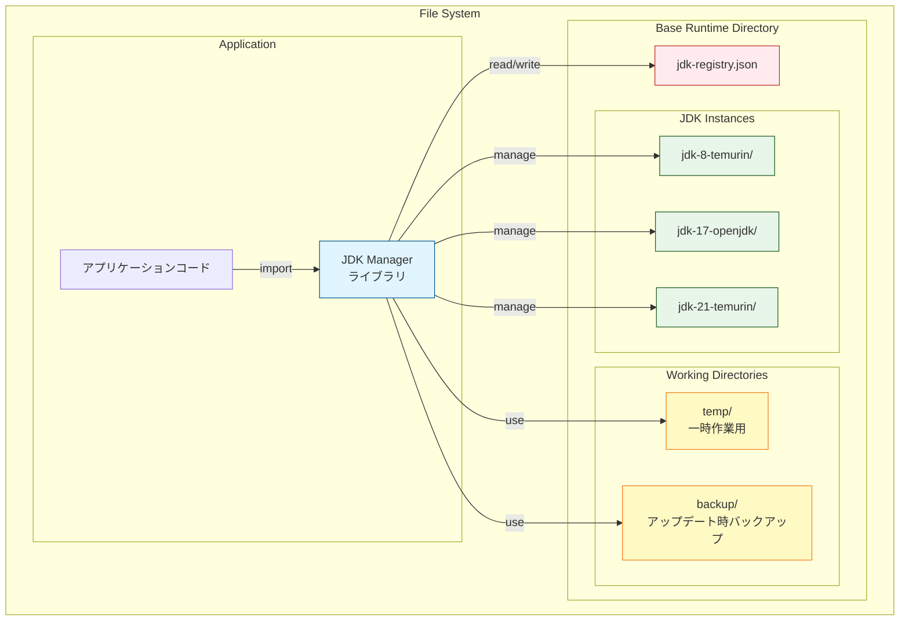

## タイミング図（ロック機構）

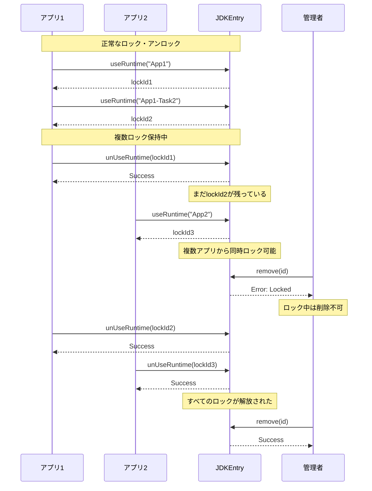

---

**このドキュメントは、JDK Managerシステムの包括的なアーキテクチャ説明を提供します。**
