# JDK Manager - Usage Examples (Mermaid Edition)

## 基本的な使用パターン

### パターン1: 初回セットアップ

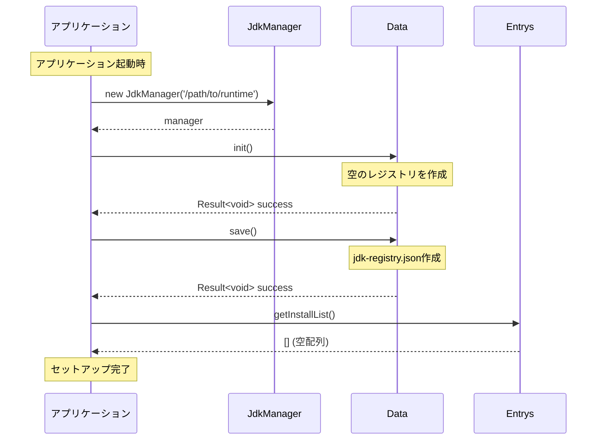
```mermaid
sequenceDiagram
    participant App as アプリケーション
    participant Manager as JdkManager
    participant Data
    participant Entrys
    
    Note over App: アプリケーション起動時
    
    App->>Manager: new JdkManager('/path/to/runtime')
    Manager-->>App: manager
    
    App->>Data: init()
    Note over Data: 空のレジストリを作成
    Data-->>App: Result<void> success
    
    App->>Data: save()
    Note over Data: jdk-registry.json作成
    Data-->>App: Result<void> success
    
    App->>Entrys: getInstallList()
    Entrys-->>App: [] (空配列)
    
    Note over App: セットアップ完了
```

### パターン2: 既存レジストリの読み込み

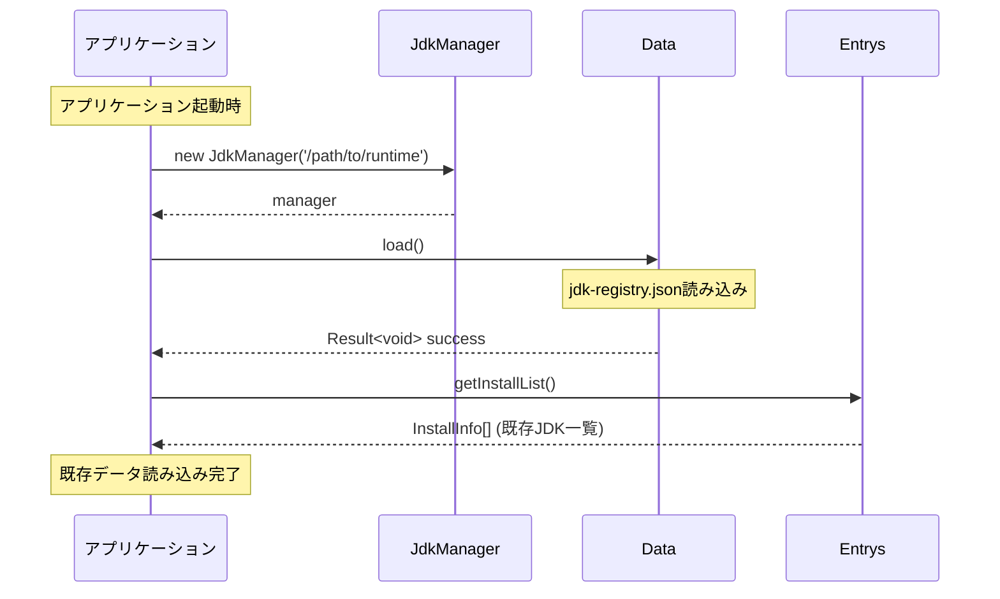
```mermaid
sequenceDiagram
    participant App as アプリケーション
    participant Manager as JdkManager
    participant Data
    participant Entrys
    
    Note over App: アプリケーション起動時
    
    App->>Manager: new JdkManager('/path/to/runtime')
    Manager-->>App: manager
    
    App->>Data: load()
    Note over Data: jdk-registry.json読み込み
    Data-->>App: Result<void> success
    
    App->>Entrys: getInstallList()
    Entrys-->>App: InstallInfo[] (既存JDK一覧)
    
    Note over App: 既存データ読み込み完了
```

## JDKインストールのパターン

### シンプルなインストール

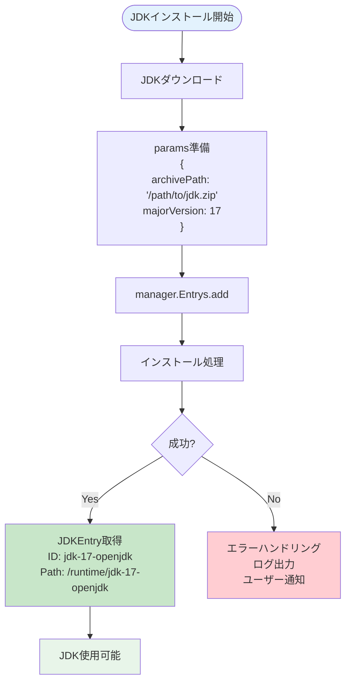
```mermaid
flowchart TD
    Start([JDKインストール開始]) --> Download[JDKダウンロード]
    
    Download --> Prepare["params準備<br/>{<br/>archivePath: '/path/to/jdk.zip'<br/>majorVersion: 17<br/>}"]
    
    Prepare --> Call[manager.Entrys.add]
    
    Call --> Process[インストール処理]
    
    Process --> Result{成功?}
    
    Result -->|Yes| Success["JDKEntry取得<br/>ID: jdk-17-openjdk<br/>Path: /runtime/jdk-17-openjdk"]
    Result -->|No| Error["エラーハンドリング<br/>ログ出力<br/>ユーザー通知"]
    
    Success --> UseJDK[JDK使用可能]
    
    style Start fill:#e3f2fd
    style Success fill:#c8e6c9
    style Error fill:#ffcdd2
    style UseJDK fill:#e8f5e9
```

### カスタム名称でのインストール

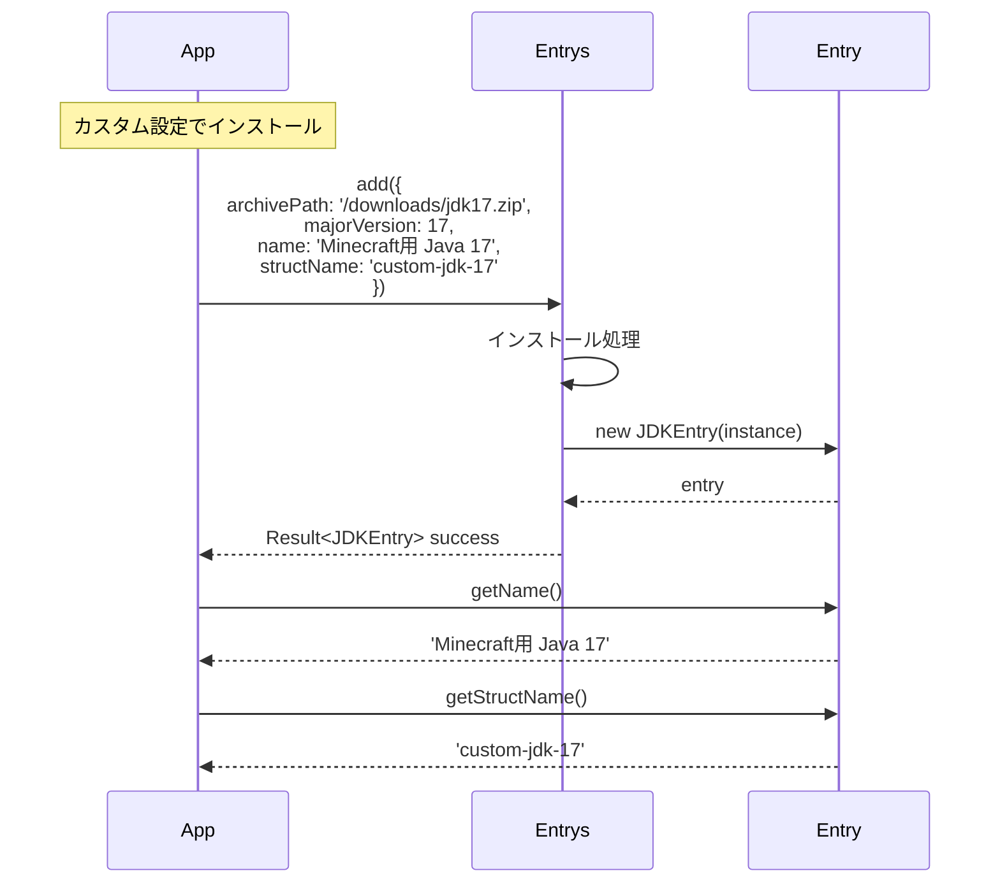
```mermaid
sequenceDiagram
    participant App
    participant Entrys
    participant Entry
    
    Note over App: カスタム設定でインストール
    
    App->>Entrys: add({<br/>archivePath: '/downloads/jdk17.zip',<br/>majorVersion: 17,<br/>name: 'Minecraft用 Java 17',<br/>structName: 'custom-jdk-17'<br/>})
    
    Entrys->>Entrys: インストール処理
    Entrys->>Entry: new JDKEntry(instance)
    Entry-->>Entrys: entry
    Entrys-->>App: Result<JDKEntry> success
    
    App->>Entry: getName()
    Entry-->>App: 'Minecraft用 Java 17'
    
    App->>Entry: getStructName()
    Entry-->>App: 'custom-jdk-17'
```

## 複数バージョンのインストール

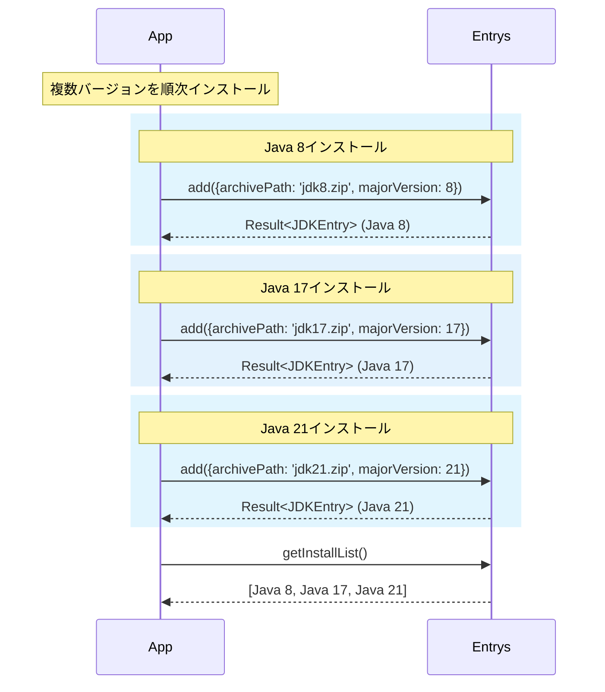
```mermaid
sequenceDiagram
    participant App
    participant Entrys
    
    Note over App: 複数バージョンを順次インストール
    
    rect rgb(225, 245, 254)
        Note over App,Entrys: Java 8インストール
        App->>Entrys: add({archivePath: 'jdk8.zip', majorVersion: 8})
        Entrys-->>App: Result<JDKEntry> (Java 8)
    end
    
    rect rgb(227, 242, 253)
        Note over App,Entrys: Java 17インストール
        App->>Entrys: add({archivePath: 'jdk17.zip', majorVersion: 17})
        Entrys-->>App: Result<JDKEntry> (Java 17)
    end
    
    rect rgb(225, 245, 254)
        Note over App,Entrys: Java 21インストール
        App->>Entrys: add({archivePath: 'jdk21.zip', majorVersion: 21})
        Entrys-->>App: Result<JDKEntry> (Java 21)
    end
    
    App->>Entrys: getInstallList()
    Entrys-->>App: [Java 8, Java 17, Java 21]
```

## ランタイムロックのパターン

### 基本的なロック管理

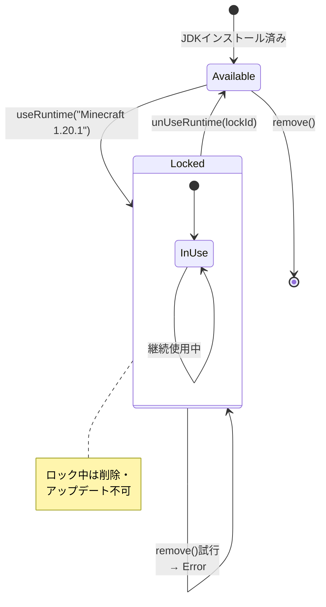
```mermaid
stateDiagram-v2
    [*] --> Available: JDKインストール済み
    
    Available --> Locked: useRuntime("Minecraft 1.20.1")
    
    state Locked {
        [*] --> InUse
        InUse --> InUse: 継続使用中
    }
    
    Locked --> Available: unUseRuntime(lockId)
    
    Available --> [*]: remove()
    
    Locked --> Locked: remove()試行<br/>→ Error
    
    note right of Locked
        ロック中は削除・
        アップデート不可
    end note
```

### 複数アプリケーションからの使用

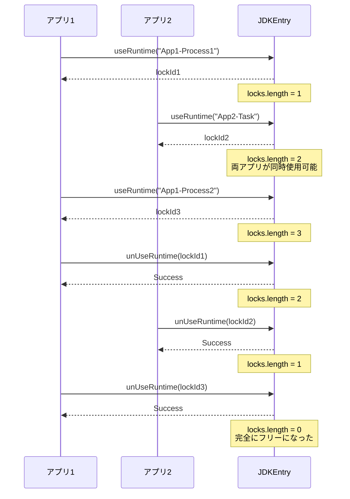
```mermaid
sequenceDiagram
    participant App1 as アプリ1
    participant App2 as アプリ2
    participant Entry as JDKEntry
    
    App1->>Entry: useRuntime("App1-Process1")
    Entry-->>App1: lockId1
    
    Note over Entry: locks.length = 1
    
    App2->>Entry: useRuntime("App2-Task")
    Entry-->>App2: lockId2
    
    Note over Entry: locks.length = 2<br/>両アプリが同時使用可能
    
    App1->>Entry: useRuntime("App1-Process2")
    Entry-->>App1: lockId3
    
    Note over Entry: locks.length = 3
    
    App1->>Entry: unUseRuntime(lockId1)
    Entry-->>App1: Success
    
    Note over Entry: locks.length = 2
    
    App2->>Entry: unUseRuntime(lockId2)
    Entry-->>App2: Success
    
    Note over Entry: locks.length = 1
    
    App1->>Entry: unUseRuntime(lockId3)
    Entry-->>App1: Success
    
    Note over Entry: locks.length = 0<br/>完全にフリーになった
```

## ファイル整合性検証のパターン

### 起動時の一括検証

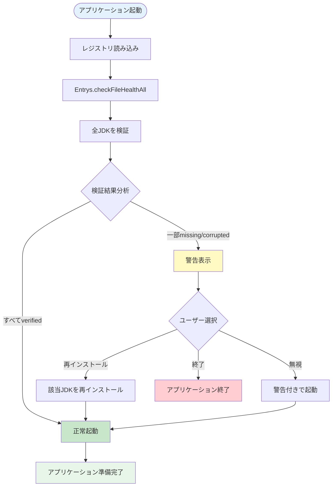
```mermaid
flowchart TD
    Start([アプリケーション起動]) --> Load[レジストリ読み込み]
    
    Load --> CheckAll[Entrys.checkFileHealthAll]
    
    CheckAll --> Process[全JDKを検証]
    
    Process --> Analyze{検証結果分析}
    
    Analyze -->|すべてverified| Normal[正常起動]
    Analyze -->|一部missing/corrupted| Warning[警告表示]
    
    Warning --> Prompt{ユーザー選択}
    Prompt -->|再インストール| Reinstall[該当JDKを再インストール]
    Prompt -->|無視| ContinueWarning[警告付きで起動]
    Prompt -->|終了| Exit[アプリケーション終了]
    
    Reinstall --> Normal
    ContinueWarning --> Normal
    
    Normal --> Ready[アプリケーション準備完了]
    
    style Start fill:#e3f2fd
    style Normal fill:#c8e6c9
    style Warning fill:#fff9c4
    style Exit fill:#ffcdd2
    style Ready fill:#e8f5e9
```

### 個別JDKの検証

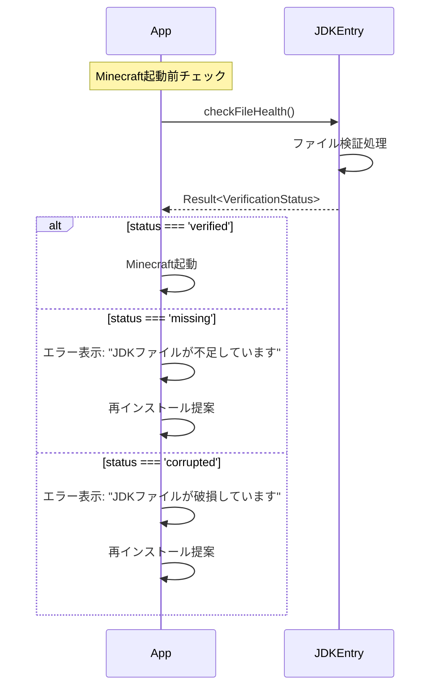
```mermaid
sequenceDiagram
    participant App
    participant Entry as JDKEntry
    
    Note over App: Minecraft起動前チェック
    
    App->>Entry: checkFileHealth()
    Entry->>Entry: ファイル検証処理
    Entry-->>App: Result<VerificationStatus>
    
    alt status === 'verified'
        App->>App: Minecraft起動
    else status === 'missing'
        App->>App: エラー表示: "JDKファイルが不足しています"
        App->>App: 再インストール提案
    else status === 'corrupted'
        App->>App: エラー表示: "JDKファイルが破損しています"
        App->>App: 再インストール提案
    end
```

### 定期的なバックグラウンド検証

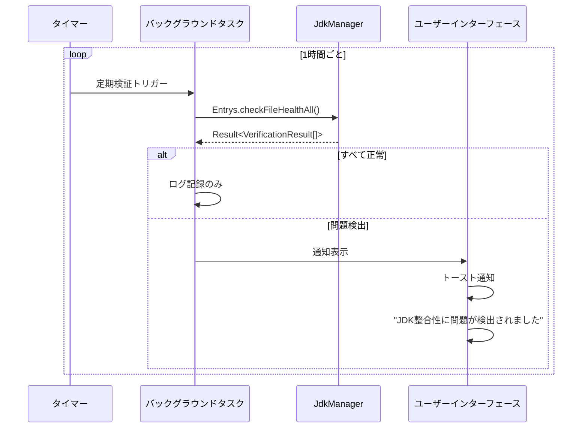
```mermaid
sequenceDiagram
    participant Timer as タイマー
    participant BG as バックグラウンドタスク
    participant Manager as JdkManager
    participant UI as ユーザーインターフェース
    
    loop 1時間ごと
        Timer->>BG: 定期検証トリガー
        BG->>Manager: Entrys.checkFileHealthAll()
        Manager-->>BG: Result<VerificationResult[]>
        
        alt すべて正常
            BG->>BG: ログ記録のみ
        else 問題検出
            BG->>UI: 通知表示
            UI->>UI: トースト通知
            UI->>UI: "JDK整合性に問題が検出されました"
        end
    end
```

## アップデート管理のパターン

### アップデートチェックとインストール

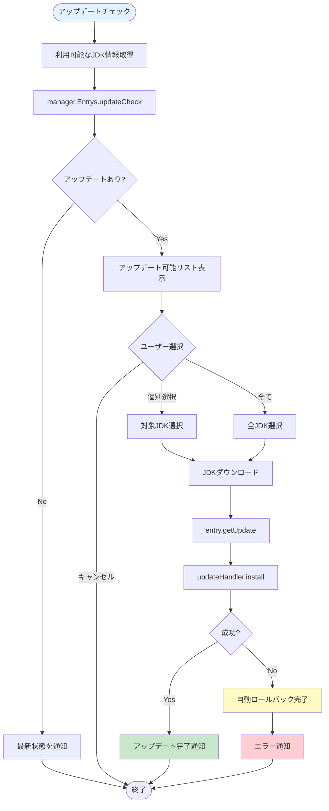
```mermaid
flowchart TD
    Start([アップデートチェック]) --> GetAvailable[利用可能なJDK情報取得]
    
    GetAvailable --> Check[manager.Entrys.updateCheck]
    
    Check --> HasUpdates{アップデートあり?}
    
    HasUpdates -->|No| NoUpdate[最新状態を通知]
    HasUpdates -->|Yes| ShowList[アップデート可能リスト表示]
    
    ShowList --> UserChoice{ユーザー選択}
    
    UserChoice -->|キャンセル| End([終了])
    UserChoice -->|個別選択| SelectItems[対象JDK選択]
    UserChoice -->|全て| SelectAll[全JDK選択]
    
    SelectItems --> Download[JDKダウンロード]
    SelectAll --> Download
    
    Download --> GetHandler[entry.getUpdate]
    GetHandler --> Install[updateHandler.install]
    
    Install --> Result{成功?}
    
    Result -->|Yes| Success[アップデート完了通知]
    Result -->|No| Rollback[自動ロールバック完了]
    
    Rollback --> Error[エラー通知]
    
    Success --> End
    NoUpdate --> End
    Error --> End
    
    style Start fill:#e3f2fd
    style Success fill:#c8e6c9
    style Error fill:#ffcdd2
    style Rollback fill:#fff9c4
```

### 個別JDKのアップデート

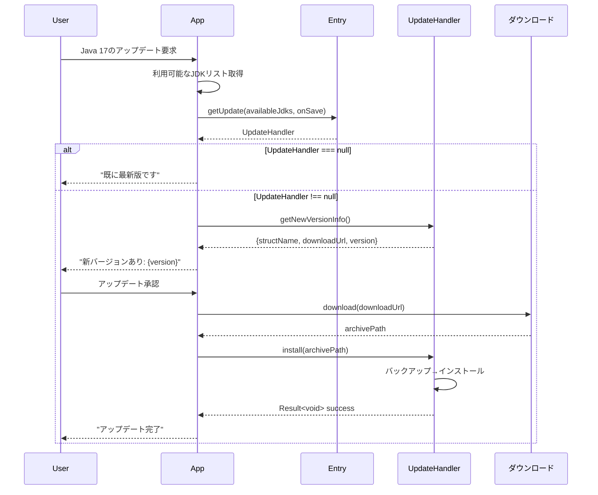
```mermaid
sequenceDiagram
    participant User
    participant App
    participant Entry
    participant Handler as UpdateHandler
    participant Download as ダウンロード
    
    User->>App: Java 17のアップデート要求
    
    App->>App: 利用可能なJDKリスト取得
    App->>Entry: getUpdate(availableJdks, onSave)
    Entry-->>App: UpdateHandler
    
    alt UpdateHandler === null
        App-->>User: "既に最新版です"
    else UpdateHandler !== null
        App->>Handler: getNewVersionInfo()
        Handler-->>App: {structName, downloadUrl, version}
        
        App-->>User: "新バージョンあり: {version}"
        User->>App: アップデート承認
        
        App->>Download: download(downloadUrl)
        Download-->>App: archivePath
        
        App->>Handler: install(archivePath)
        Handler->>Handler: バックアップ→インストール
        Handler-->>App: Result<void> success
        
        App-->>User: "アップデート完了"
    end
```

## エラーハンドリングのパターン

### Result型の使用例

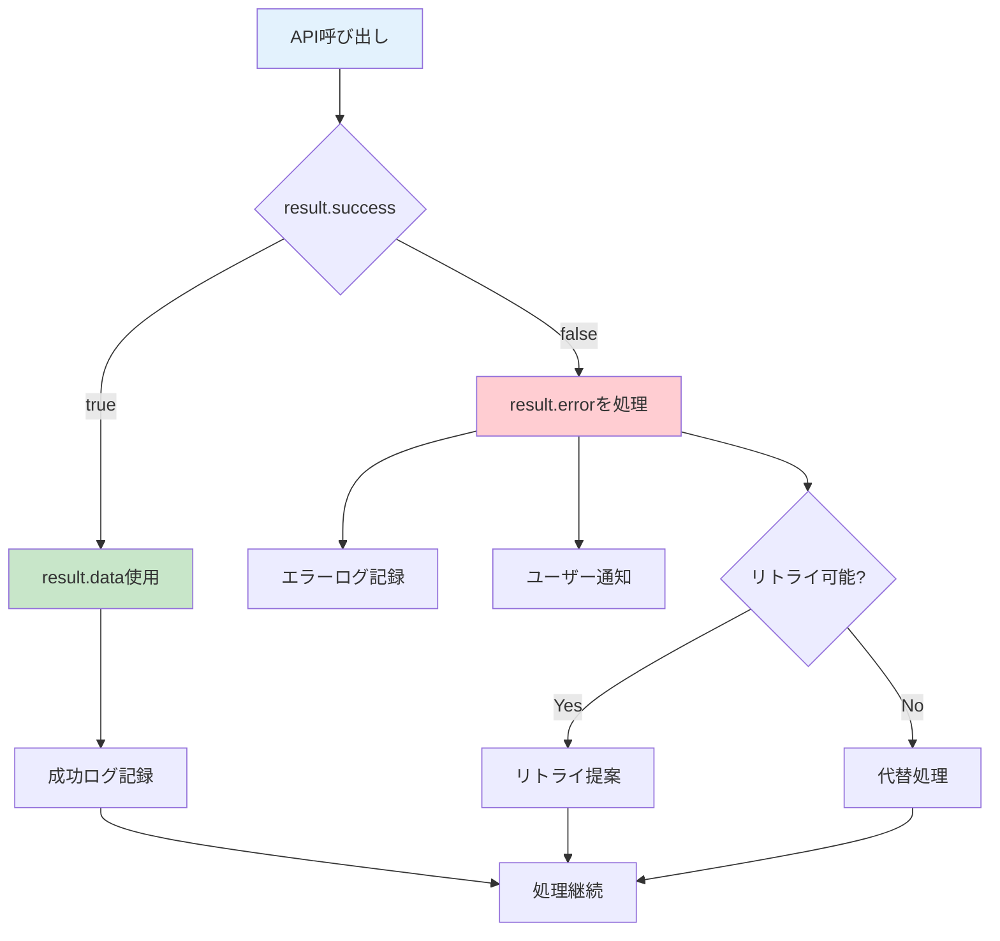
```mermaid
flowchart TD
    Call[API呼び出し] --> Check{result.success}
    
    Check -->|true| Success[result.data使用]
    Check -->|false| Error[result.errorを処理]
    
    Success --> Log1[成功ログ記録]
    Error --> Log2[エラーログ記録]
    
    Error --> UserNotify[ユーザー通知]
    Error --> Retry{リトライ可能?}
    
    Retry -->|Yes| Prompt[リトライ提案]
    Retry -->|No| Fallback[代替処理]
    
    Log1 --> Continue[処理継続]
    Prompt --> Continue
    Fallback --> Continue
    
    style Call fill:#e3f2fd
    style Success fill:#c8e6c9
    style Error fill:#ffcdd2
```

### エラーごとの対応フロー

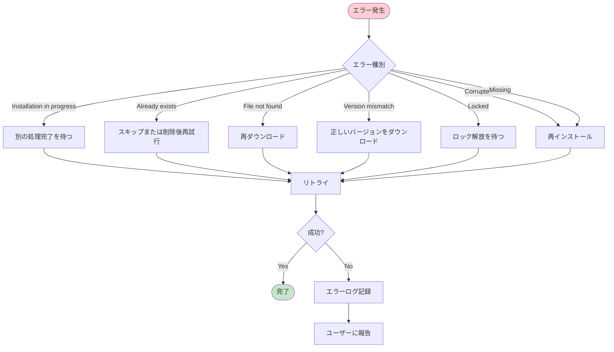
```mermaid
graph TD
    Error([エラー発生]) --> Type{エラー種別}
    
    Type -->|Installation in progress| Wait[別の処理完了を待つ]
    Type -->|Already exists| Skip[スキップまたは削除後再試行]
    Type -->|File not found| Redownload[再ダウンロード]
    Type -->|Version mismatch| CorrectDownload[正しいバージョンをダウンロード]
    Type -->|Locked| WaitUnlock[ロック解放を待つ]
    Type -->|Corrupted| Reinstall[再インストール]
    Type -->|Missing| Reinstall
    
    Wait --> Retry[リトライ]
    Skip --> Retry
    Redownload --> Retry
    CorrectDownload --> Retry
    WaitUnlock --> Retry
    Reinstall --> Retry
    
    Retry --> Success{成功?}
    Success -->|Yes| Complete([完了])
    Success -->|No| LogError[エラーログ記録]
    
    LogError --> UserReport[ユーザーに報告]
    
    style Error fill:#ffcdd2
    style Complete fill:#c8e6c9
```

## 実践的な統合例

### Minecraftランチャーとの統合

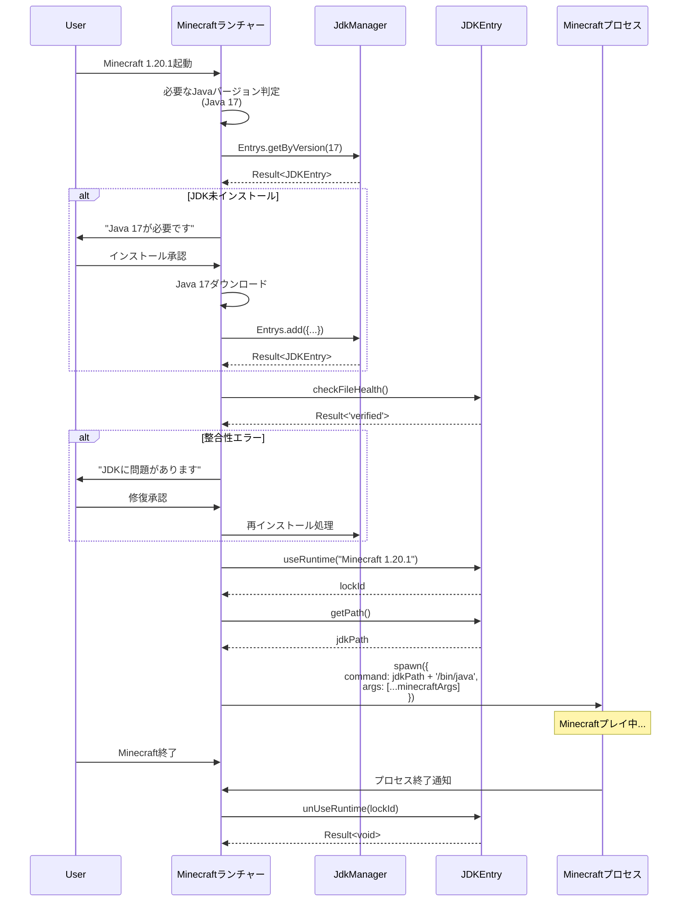
```mermaid
sequenceDiagram
    participant User
    participant Launcher as Minecraftランチャー
    participant Manager as JdkManager
    participant Entry as JDKEntry
    participant MC as Minecraftプロセス
    
    User->>Launcher: Minecraft 1.20.1起動
    Launcher->>Launcher: 必要なJavaバージョン判定<br/>(Java 17)
    
    Launcher->>Manager: Entrys.getByVersion(17)
    Manager-->>Launcher: Result<JDKEntry>
    
    alt JDK未インストール
        Launcher->>User: "Java 17が必要です"
        User->>Launcher: インストール承認
        Launcher->>Launcher: Java 17ダウンロード
        Launcher->>Manager: Entrys.add({...})
        Manager-->>Launcher: Result<JDKEntry>
    end
    
    Launcher->>Entry: checkFileHealth()
    Entry-->>Launcher: Result<'verified'>
    
    alt 整合性エラー
        Launcher->>User: "JDKに問題があります"
        User->>Launcher: 修復承認
        Launcher->>Manager: 再インストール処理
    end
    
    Launcher->>Entry: useRuntime("Minecraft 1.20.1")
    Entry-->>Launcher: lockId
    
    Launcher->>Entry: getPath()
    Entry-->>Launcher: jdkPath
    
    Launcher->>MC: spawn({<br/>command: jdkPath + '/bin/java',<br/>args: [...minecraftArgs]<br/>})
    
    Note over MC: Minecraftプレイ中...
    
    User->>Launcher: Minecraft終了
    MC->>Launcher: プロセス終了通知
    
    Launcher->>Entry: unUseRuntime(lockId)
    Entry-->>Launcher: Result<void>
```

### 自動メンテナンスシステム

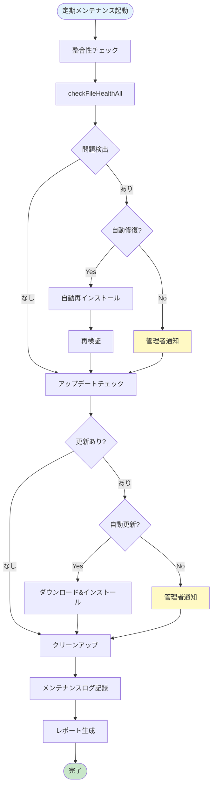
```mermaid
flowchart TD
    Start([定期メンテナンス起動]) --> Check[整合性チェック]
    
    Check --> Verify[checkFileHealthAll]
    Verify --> Analyze{問題検出}
    
    Analyze -->|なし| UpdateCheck[アップデートチェック]
    Analyze -->|あり| Fix{自動修復?}
    
    Fix -->|Yes| Reinstall[自動再インストール]
    Fix -->|No| Notify1[管理者通知]
    
    Reinstall --> Verify2[再検証]
    Verify2 --> UpdateCheck
    Notify1 --> UpdateCheck
    
    UpdateCheck --> Updates{更新あり?}
    
    Updates -->|なし| Cleanup[クリーンアップ]
    Updates -->|あり| AutoUpdate{自動更新?}
    
    AutoUpdate -->|Yes| Download[ダウンロード&インストール]
    AutoUpdate -->|No| Notify2[管理者通知]
    
    Download --> Cleanup
    Notify2 --> Cleanup
    
    Cleanup --> Log[メンテナンスログ記録]
    Log --> Report[レポート生成]
    
    Report --> End([完了])
    
    style Start fill:#e3f2fd
    style End fill:#c8e6c9
    style Notify1 fill:#fff9c4
    style Notify2 fill:#fff9c4
```

## ドライランモードの使用

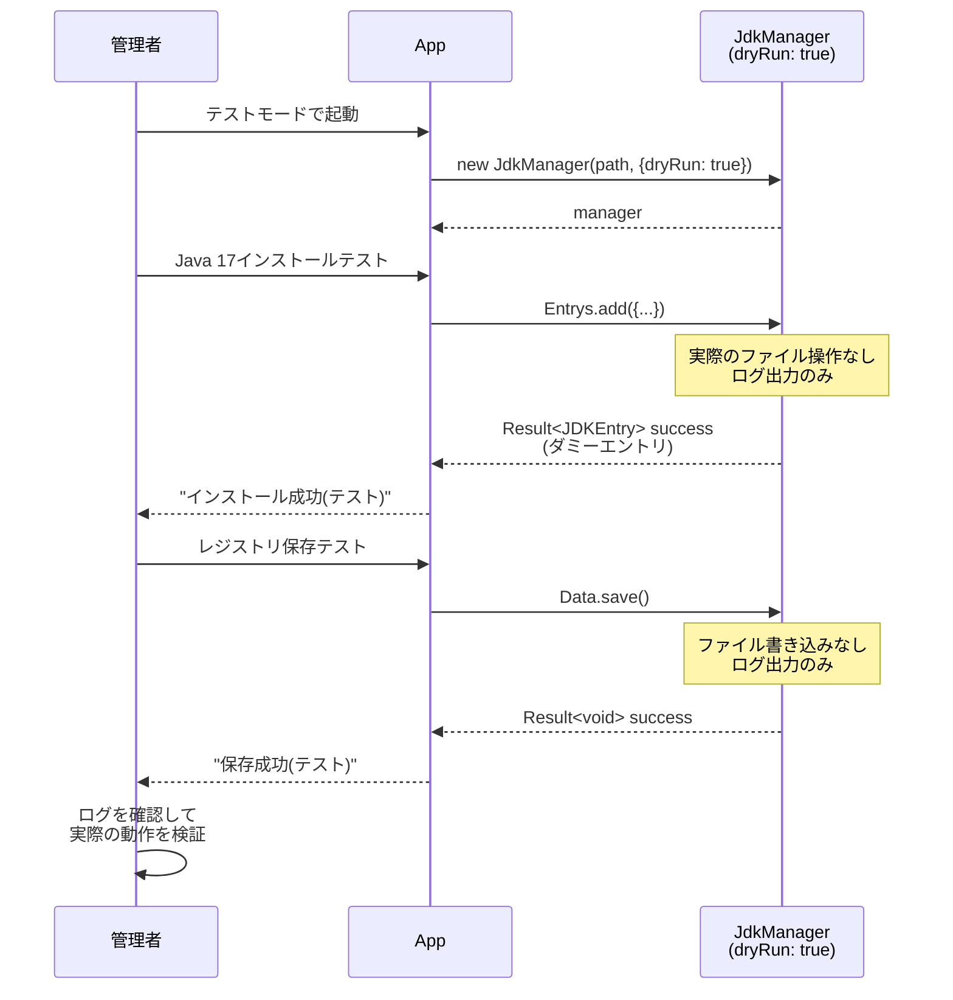
```mermaid
sequenceDiagram
    participant Admin as 管理者
    participant App
    participant Manager as JdkManager<br/>(dryRun: true)
    
    Admin->>App: テストモードで起動
    App->>Manager: new JdkManager(path, {dryRun: true})
    Manager-->>App: manager
    
    Admin->>App: Java 17インストールテスト
    App->>Manager: Entrys.add({...})
    
    Note over Manager: 実際のファイル操作なし<br/>ログ出力のみ
    
    Manager-->>App: Result<JDKEntry> success<br/>(ダミーエントリ)
    
    App-->>Admin: "インストール成功(テスト)"
    
    Admin->>App: レジストリ保存テスト
    App->>Manager: Data.save()
    
    Note over Manager: ファイル書き込みなし<br/>ログ出力のみ
    
    Manager-->>App: Result<void> success
    
    App-->>Admin: "保存成功(テスト)"
    
    Admin->>Admin: ログを確認して<br/>実際の動作を検証
```

---

**このドキュメントは、JDK Managerの実践的な使用例をMermaid図で提供します。**
