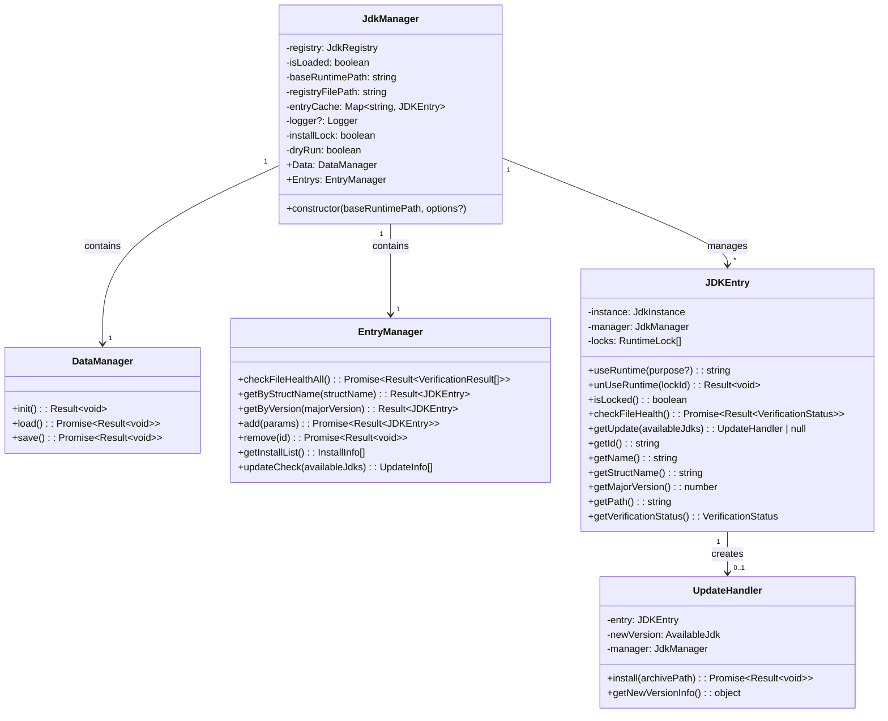
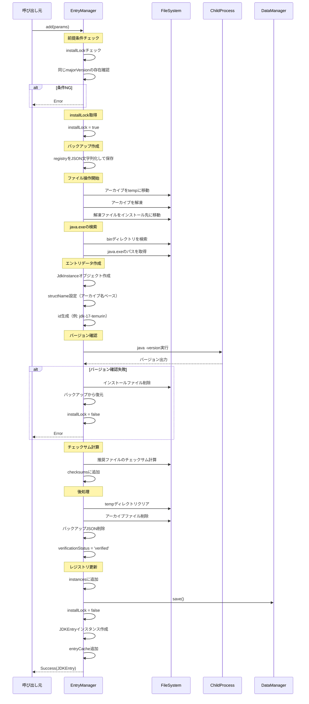
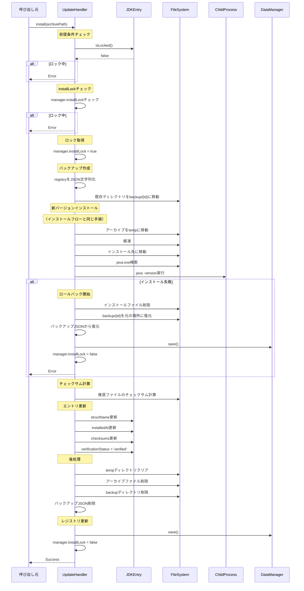
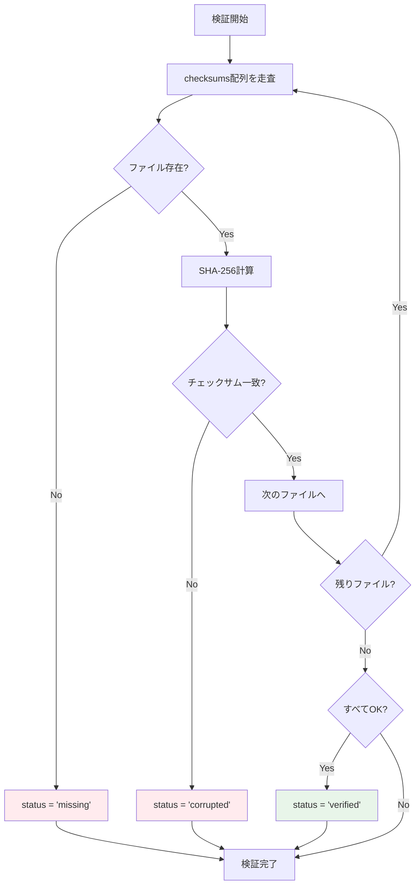

# JDK管理システム 設計書・仕様書

**バージョン:** 1.0.0  
**最終更新:** 2025-10-21  
**プロジェクト:** Minecraft用Java実行環境管理システム  
**技術スタック:** Node.js + TypeScript

---

## 目次

1. [プロジェクト概要](#1-プロジェクト概要)
2. [データスキーマ](#2-データスキーマ)
3. [クラス設計](#3-クラス設計)
4. [機能仕様](#4-機能仕様)
5. [インストール・アップデートフロー](#5-インストールアップデートフロー)
6. [エラーハンドリング](#6-エラーハンドリング)
7. [ファイルシステム構造](#7-ファイルシステム構造)
8. [外部依存関係](#8-外部依存関係)
9. [セキュリティ・整合性管理](#9-セキュリティ整合性管理)
10. [実装上の注意事項](#10-実装上の注意事項)

---

## 1. プロジェクト概要

### 1.1 目的

Minecraft用のJava実行環境（JDK）を効率的に管理するシステムを構築します。複数バージョンのJDKを一元管理し、ファイル整合性の検証を通じてアンチウイルスソフトによる誤削除を検出・対応します。

### 1.2 主要機能

- 複数バージョンのJDK管理（メジャーバージョンごとに1つ）
- JDKのインストール・アップデート・削除
- ファイル整合性検証（チェックサム）
- ランタイム使用ロック機構
- アップデート可能性チェック
- ロールバック機能
- ロギング機能
- ドライランモード

### 1.3 前提条件

- ダウンロード処理は外部の汎用HTTPダウンロードクラスが担当
- JDKアーカイブファイルはダウンロード完了後、ローカルパスとして渡される
- 上位にオーケストレータクラスが存在し、全体の処理フローを制御
- 主な対象OS: Windows（Linux対応も考慮）
- macOSはビルド環境がないため優先度低

---

## 2. データスキーマ

### 2.1 型定義

```typescript
/**
 * ファイルのチェックサム情報
 */
export interface FileChecksum {
  path: string;           // ファイルの相対パス
  checksum: string;       // SHA-256ハッシュ値
  lastVerified: string;   // 最終確認日時（ISO 8601）
}

/**
 * 検証ステータス
 */
export type VerificationStatus = 
  | 'verified'    // 検証済み・正常
  | 'unverified'  // 未検証
  | 'corrupted'   // 破損検出
  | 'missing';    // ファイル欠損

/**
 * JDKインスタンスの情報
 */
export interface JdkInstance {
  id: string;                           // 一意識別子（ディレクトリ名）
  name: string;                         // 簡易名称（例: "Java 17"）
  structName: string;                   // 正式名称（アーカイブファイル名ベース）
  majorVersion: number;                 // メジャーバージョン
  os: string;                           // OS種別
  installedAt: string;                  // インストール日時（ISO 8601）
  checksums: FileChecksum[];            // ファイル整合性チェック情報
  verificationStatus: VerificationStatus; // 検証ステータス
}

/**
 * グローバルJDK管理データ
 */
export interface JdkRegistry {
  schemaVersion: string;      // スキーマバージョン（例: "1.0.0"）
  baseRuntimePath: string;    // ベースディレクトリ
  activeJdkId?: string;       // アクティブなJDKのID
  instances: JdkInstance[];   // 登録されているJDKインスタンス
  lastUpdated: string;        // 最終更新日時（ISO 8601）
}

/**
 * ランタイムロック情報
 */
export interface RuntimeLock {
  lockId: string;      // UUID
  lockedAt: string;    // ロック取得日時（ISO 8601）
  purpose?: string;    // ロック目的（例: "Minecraft 1.20.1"）
}

/**
 * 汎用Result型
 */
export type Result<T> = 
  | { success: true; data: T }
  | { success: false; error: string };

/**
 * JDK追加パラメータ
 */
export interface AddJdkParams {
  archivePath: string;      // ダウンロード済みアーカイブのフルパス
  majorVersion: number;     // メジャーバージョン
  structName?: string;      // 省略時はアーカイブファイル名から自動生成
  name?: string;           // 省略時は "Java {majorVersion}"
}

/**
 * インストール情報（リスト表示用）
 */
export interface InstallInfo {
  id: string;
  majorVersion: number;
  name: string;
  structName: string;
  verificationStatus: VerificationStatus;
}

/**
 * 利用可能なJDK情報（外部API形式）
 */
export interface AvailableJdk {
  version: string;           // "8", "17", "21"
  downloads: {
    os: string;              // "windows", "linux", "macos"
    downloadUrl: string;
  }[];
  vendor?: string;
  isLTS?: boolean;
}

/**
 * アップデート情報
 */
export interface UpdateInfo {
  entry: JDKEntry;
  currentStructName: string;
  availableStructName: string;
  downloadUrl: string;
  majorVersion: number;
}

/**
 * 検証結果
 */
export interface VerificationResult {
  id: string;
  status: VerificationStatus;
  missingFiles?: string[];
  corruptedFiles?: string[];
}
```

### 2.2 JSONファイル構造

レジストリデータは`{baseRuntimePath}/jdk-registry.json`に保存されます。

**例:**

```json
{
  "schemaVersion": "1.0.0",
  "baseRuntimePath": "C:\\GameRuntimes\\Java",
  "activeJdkId": "jdk-17-temurin",
  "instances": [
    {
      "id": "jdk-17-temurin",
      "name": "Java 17",
      "structName": "OpenJDK17U-jdk_x64_windows_hotspot_17.0.8_7",
      "majorVersion": 17,
      "os": "windows",
      "installedAt": "2024-03-15T10:30:00Z",
      "checksums": [
        {
          "path": "bin/java.exe",
          "checksum": "a3c5f1d8...",
          "lastVerified": "2025-10-21T08:00:00Z"
        }
      ],
      "verificationStatus": "verified"
    }
  ],
  "lastUpdated": "2025-10-21T08:45:00Z"
}
```

---

## 3. クラス設計

### 3.1 クラス構成図



### 3.2 JdkManagerクラス

メインクラス。JDK管理システム全体を統括します。

**プロパティ:**

| 名前 | 型 | 説明 |
|------|-----|------|
| `registry` | `JdkRegistry` | レジストリデータ |
| `isLoaded` | `boolean` | データロード済みフラグ |
| `baseRuntimePath` | `string` | ベースディレクトリパス |
| `registryFilePath` | `string` | レジストリJSONファイルパス |
| `entryCache` | `Map<string, JDKEntry>` | JDKEntryインスタンスキャッシュ |
| `logger` | `Logger?` | ロガーインスタンス |
| `installLock` | `boolean` | インストール処理ロックフラグ |
| `dryRun` | `boolean` | ドライランモードフラグ |

**コンストラクタ:**

```typescript
constructor(baseRuntimePath: string, options?: {
  logPath?: string;
  dryRun?: boolean;
})
```

- `baseRuntimePath`: すべてのJDKを配置する親ディレクトリ
- `options.logPath`: ログファイルの出力パス（省略可）
- `options.dryRun`: ドライランモード有効化（省略可、デフォルト: false）

**初期化処理:**

1. `baseRuntimePath`を保存
2. `registryFilePath`を`{baseRuntimePath}/jdk-registry.json`に設定
3. `isLoaded`を`false`に初期化
4. `entryCache`を空のMapで初期化
5. `installLock`を`false`に初期化
6. `logPath`が指定されている場合、ロガーを初期化
7. `dryRun`フラグを設定

### 3.3 DataManagerクラス

データの永続化を担当します。`JdkManager`の内部クラスとして実装します。

**メソッド:**

**init(): Result<void>**

メモリ上に空のJdkRegistryを初期化します。JSONファイルには触りません。

- 処理内容:
  1. 空の`JdkRegistry`オブジェクトを作成
  2. `schemaVersion`を"1.0.0"に設定
  3. `baseRuntimePath`を設定
  4. `instances`を空配列で初期化
  5. `lastUpdated`を現在時刻に設定
  6. `isLoaded`を`true`に設定
- 戻り値: `Result<void>`

**load(): Promise<Result<void>>**

レジストリJSONファイルを読み込み、メモリに展開します。

- 処理内容:
  1. `registryFilePath`の存在確認
  2. ファイルが存在しない場合、エラーを返す
  3. ファイルを読み込み、JSONパース
  4. スキーマバージョンの検証
  5. `registry`に格納
  6. `isLoaded`を`true`に設定
  7. ログ出力（ロガーが有効な場合）
- 戻り値: `Promise<Result<void>>`
- エラー条件:
  - ファイルが存在しない
  - JSON形式が不正
  - スキーマバージョンが互換性なし

**save(): Promise<Result<void>>**

メモリ上のレジストリデータをJSONファイルに保存します。

- 処理内容:
  1. `isLoaded`が`false`の場合、エラーを返す
  2. `lastUpdated`を現在時刻に更新
  3. JSONシリアライズ（インデント2スペース）
  4. ドライランモードの場合、ログ出力のみで終了
  5. `registryFilePath`に書き込み
  6. ログ出力（ロガーが有効な場合）
- 戻り値: `Promise<Result<void>>`
- エラー条件:
  - データが未ロード
  - ファイル書き込み失敗

### 3.4 EntryManagerクラス

JDKエントリの管理を担当します。`JdkManager`の内部クラスとして実装します。

**メソッド:**

**checkFileHealthAll(): Promise<Result<VerificationResult[]>>**

すべてのJDKエントリのファイル整合性を検証します。

- 処理内容:
  1. すべての`instances`を走査
  2. 各エントリに対して`JDKEntry.checkFileHealth()`を呼び出し
  3. 結果を`VerificationResult[]`として集約
  4. `Data.save()`を呼び出してレジストリを更新
- 戻り値: `Promise<Result<VerificationResult[]>>`

**getByStructName(structName: string): Result<JDKEntry>**

正式名称でJDKエントリを検索します。

- 処理内容:
  1. `instances`から`structName`が一致するエントリを検索
  2. 見つかった場合、`JDKEntry`インスタンスを返す（キャッシュ使用）
  3. 見つからない場合、エラーを返す
- 戻り値: `Result<JDKEntry>`

**getByVersion(majorVersion: number): Result<JDKEntry>**

メジャーバージョンでJDKエントリを検索します。

- 処理内容:
  1. `instances`から`majorVersion`が一致するエントリを検索
  2. 見つかった場合、`JDKEntry`インスタンスを返す（キャッシュ使用）
  3. 見つからない場合、エラーを返す
- 戻り値: `Result<JDKEntry>`

**add(params: AddJdkParams): Promise<Result<JDKEntry>>**

新しいJDKをインストールします。詳細は[5.1 インストールフロー](#51-インストールフロー)を参照。

- パラメータ:
  - `archivePath`: ダウンロード済みアーカイブのフルパス
  - `majorVersion`: メジャーバージョン
  - `structName`: 正式名称（省略時は自動生成）
  - `name`: 簡易名称（省略時は"Java {majorVersion}"）
- 戻り値: `Promise<Result<JDKEntry>>`
- エラー条件:
  - 同じ`majorVersion`のJDKが既に存在
  - インストール処理が実行中（`installLock`が`true`）
  - アーカイブファイルが存在しない
  - 解凍失敗
  - `java -version`の実行失敗

**remove(id: string): Promise<Result<void>>**

指定されたJDKを削除します。

- 処理内容:
  1. 指定された`id`のエントリを検索
  2. エントリが存在しない場合、エラーを返す
  3. エントリがロックされている場合、エラーを返す
  4. ドライランモードの場合、ログ出力のみで終了
  5. ディレクトリを削除
  6. `instances`から該当エントリを削除
  7. `entryCache`から削除
  8. `activeJdkId`が削除対象の場合、`undefined`に設定
  9. `Data.save()`を呼び出し
- 戻り値: `Promise<Result<void>>`
- エラー条件:
  - エントリが存在しない
  - エントリがロック中
  - ディレクトリ削除失敗

**getInstallList(): InstallInfo[]**

インストール済みJDKのリストを取得します。

- 処理内容:
  1. すべての`instances`を走査
  2. 各エントリから必要な情報を抽出
  3. `InstallInfo[]`として返す
- 戻り値: `InstallInfo[]`

**updateCheck(availableJdks: AvailableJdk[]): UpdateInfo[]**

アップデート可能なJDKを検出します。

- 処理内容:
  1. 現在のOSを判定（`process.platform`）
  2. `availableJdks`から現在のOSに対応するダウンロードURLを抽出
  3. 各`instance`に対して以下を実行:
     - `majorVersion`が一致する`availableJdk`を検索
     - ダウンロードURLからファイル名を抽出
     - 現在の`structName`と比較
     - 異なる場合、`UpdateInfo`を作成
  4. すべての`UpdateInfo`を配列として返す
- 戻り値: `UpdateInfo[]`

### 3.5 JDKEntryクラス

個別のJDKインスタンスに対する操作を提供します。

**プロパティ:**

| 名前 | 型 | 説明 |
|------|-----|------|
| `instance` | `JdkInstance` | JDKインスタンスデータ |
| `manager` | `JdkManager` | 親マネージャーへの参照 |
| `locks` | `RuntimeLock[]` | ランタイムロック情報 |

**メソッド:**

**useRuntime(purpose?: string): string**

ランタイムの使用をロックし、lockIdを返します。

- 処理内容:
  1. UUIDを生成
  2. `RuntimeLock`オブジェクトを作成
  3. `locks`配列に追加
  4. ログ出力
  5. UUIDを返す
- 戻り値: `string`（lockId）

**unUseRuntime(lockId: string): Result<void>**

ランタイムのロックを解除します。

- 処理内容:
  1. `locks`配列から`lockId`が一致するロックを検索
  2. 見つからない場合、エラーを返す
  3. 配列から削除
  4. ログ出力
- 戻り値: `Result<void>`

**isLocked(): boolean**

ランタイムがロックされているかを確認します。

- 戻り値: `locks`配列が空でない場合`true`

**checkFileHealth(): Promise<Result<VerificationStatus>>**

ファイルの整合性を検証します。詳細は[9.2 整合性検証](#92-整合性検証)を参照。

- 処理内容:
  1. `checksums`配列のすべてのファイルを走査
  2. ファイルの存在確認
  3. 存在する場合、SHA-256チェックサムを計算
  4. 保存されているチェックサムと比較
  5. すべて一致: `verified`
  6. ファイルが存在しない: `missing`
  7. チェックサム不一致: `corrupted`
  8. `verificationStatus`を更新
  9. `lastVerified`を現在時刻に更新
- 戻り値: `Promise<Result<VerificationStatus>>`

**getUpdate(availableJdks: AvailableJdk[]): UpdateHandler | null**

アップデート可能かを確認し、可能な場合はUpdateHandlerを返します。

- 処理内容:
  1. 現在のOSを判定
  2. `availableJdks`から`majorVersion`が一致するものを検索
  3. 見つからない場合、`null`を返す
  4. OSに対応するダウンロードURLを取得
  5. URLからファイル名を抽出
  6. 現在の`structName`と比較
  7. 異なる場合、`UpdateHandler`を作成して返す
  8. 同じ場合、`null`を返す
- 戻り値: `UpdateHandler | null`

**ゲッターメソッド:**

- `getId()`: `instance.id`を返す
- `getName()`: `instance.name`を返す
- `getStructName()`: `instance.structName`を返す
- `getMajorVersion()`: `instance.majorVersion`を返す
- `getPath()`: `{baseRuntimePath}/{instance.id}`を返す
- `getVerificationStatus()`: `instance.verificationStatus`を返す

### 3.6 UpdateHandlerクラス

JDKのアップデート処理を担当します。

**プロパティ:**

| 名前 | 型 | 説明 |
|------|-----|------|
| `entry` | `JDKEntry` | アップデート対象のエントリ |
| `newVersion` | `AvailableJdk` | 新バージョン情報 |
| `manager` | `JdkManager` | マネージャーへの参照 |

**メソッド:**

**install(archivePath: string): Promise<Result<void>>**

アップデートをインストールします。詳細は[5.2 アップデートフロー](#52-アップデートフロー)を参照。

- パラメータ:
  - `archivePath`: ダウンロード済みアーカイブのフルパス
- 戻り値: `Promise<Result<void>>`
- エラー条件:
  - エントリがロック中
  - バックアップ失敗
  - インストール失敗（ロールバック実行）

**getNewVersionInfo(): { structName: string; downloadUrl: string }**

新バージョンの情報を取得します。

- 戻り値: 新バージョンの`structName`と`downloadUrl`を含むオブジェクト

---

## 4. 機能仕様

### 4.1 データ管理機能

**初期化 (Data.init)**

- 空のレジストリデータをメモリ上に作成
- JSONファイルには触らない
- `isLoaded`を`true`に設定

**ロード (Data.load)**

- `{baseRuntimePath}/jdk-registry.json`を読み込み
- JSONパースしてメモリに展開
- スキーマバージョンの検証
- `isLoaded`を`true`に設定

**セーブ (Data.save)**

- メモリ上のデータをJSONシリアライズ
- `{baseRuntimePath}/jdk-registry.json`に書き込み
- ドライランモードの場合、実際の書き込みはスキップ

### 4.2 エントリ管理機能

**検索機能**

- `getByStructName`: 正式名称で検索
- `getByVersion`: メジャーバージョンで検索
- キャッシュ機構により、同じエントリに対しては同じインスタンスを返す

**追加機能 (add)**

- 新しいJDKをインストール
- 同じメジャーバージョンが既に存在する場合はエラー
- インストール処理中は`installLock`でロック

**削除機能 (remove)**

- 指定されたJDKを削除
- ロック中のエントリは削除不可
- ディレクトリとレジストリエントリを両方削除

**リスト取得 (getInstallList)**

- インストール済みJDKの一覧を返す
- UI表示用の簡易情報

**アップデートチェック (updateCheck)**

- 利用可能なJDKリストと比較
- アップデート可能なエントリを検出
- OSに応じたダウンロードURLを提供

**健全性チェック (checkFileHealthAll)**

- すべてのJDKエントリのファイル整合性を検証
- チェックサムの不一致や欠損を検出
- 検証結果をレジストリに保存

### 4.3 ランタイムロック機能

**ロック取得 (useRuntime)**

- JDKの使用を宣言し、UUIDを取得
- 複数のロックを同時に保持可能（参照カウント方式）
- ロック中のJDKは削除・アップデート不可

**ロック解放 (unUseRuntime)**

- lockIdを指定してロックを解放
- すべてのロックが解放されるまで、削除・アップデート不可

**ロック状態確認 (isLocked)**

- 現在ロックされているかを確認

### 4.4 整合性検証機能

**個別検証 (checkFileHealth)**

- 特定のJDKエントリのファイル整合性を検証
- チェックサム対象ファイル:
  - `bin/java.exe` (Windows) / `bin/java` (Unix)
  - `bin/javaw.exe` (Windows)
  - `bin/javac.exe` (Windows) / `bin/javac` (Unix)
  - `lib/modules`
  - `lib/jrt-fs.jar`
- 検証結果を`verificationStatus`に反映

**一括検証 (checkFileHealthAll)**

- すべてのJDKエントリを検証
- 検証結果を配列で返す

### 4.5 アップデート機能

**アップデート確認 (getUpdate)**

- 利用可能な新バージョンがあるかを確認
- ある場合は`UpdateHandler`を返す

**アップデート実行 (UpdateHandler.install)**

- 既存JDKをバックアップ
- 新バージョンをインストール
- 失敗時はロールバック
- 成功時はバックアップを削除

---

## 5. インストール・アップデートフロー

### 5.1 インストールフロー



**詳細手順:**

1. **前提条件チェック**
   - `installLock`が`false`であることを確認
   - 同じ`majorVersion`のエントリが存在しないことを確認
   - アーカイブファイルが存在することを確認

2. **ロック取得**
   - `installLock`を`true`に設定

3. **バックアップ作成**
   - 現在の`registry`をJSON文字列化してメモリに保持

4. **ファイル操作**
   - アーカイブファイルをtempディレクトリに移動（`mv`コマンド相当）
   - アーカイブを解凍
     - Windows: `.zip`
     - Linux: `.tar.gz`
   - 解凍されたファイル群をインストール先に移動
     - インストール先: `{baseRuntimePath}/{id}`
     - `id`の生成ルール: `jdk-{majorVersion}-{vendor}`
       - vendorはアーカイブ名から推測（例: temurin, oracle）

5. **java.exeの検索**
   - インストール先ディレクトリ内で`bin`ディレクトリを検索
   - `bin/java.exe`（Windows）または`bin/java`（Unix）のパスを取得

6. **エントリデータ作成**
   - `JdkInstance`オブジェクトを作成
   - `id`: 上記で生成したID
   - `name`: `params.name`または`"Java {majorVersion}"`
   - `structName`: `params.structName`またはアーカイブファイル名から拡張子を除いたもの
   - `majorVersion`: `params.majorVersion`
   - `os`: `process.platform`から判定
   - `installedAt`: 現在時刻
   - `checksums`: 空配列（後で追加）
   - `verificationStatus`: `'unverified'`

7. **バージョン確認**
   - `java -version`をchild_processで実行
   - 標準エラー出力をキャプチャ（多くのJDKは標準エラーに出力）
   - 出力からメジャーバージョンを抽出
   - `params.majorVersion`と一致することを確認

8. **チェックサム計算**
   - 推奨ファイルのチェックサムを計算:
     - `bin/java.exe` (Windows) / `bin/java` (Unix)
     - `bin/javaw.exe` (Windows)
     - `bin/javac.exe` (Windows) / `bin/javac` (Unix)
     - `lib/modules`
     - `lib/jrt-fs.jar`
   - 存在するファイルのみを対象
   - SHA-256ハッシュを計算
   - `FileChecksum`オブジェクトを作成して`checksums`に追加

9. **後処理**
   - tempディレクトリの内容を削除
   - 元のアーカイブファイルを削除
   - バックアップJSON文字列を削除（ガベージコレクション）
   - `verificationStatus`を`'verified'`に更新

10. **レジストリ更新**
    - `instances`配列に新しいエントリを追加
    - `Data.save()`を呼び出し

11. **ロック解放**
    - `installLock`を`false`に設定

12. **JDKEntryインスタンス作成**
    - 新しい`JDKEntry`インスタンスを作成
    - `entryCache`に追加
    - 呼び出し元に返す

**エラーハンドリング:**

- いずれかの手順で失敗した場合:
  1. インストールファイルを削除
  2. バックアップJSONから`registry`を復元
  3. `installLock`を`false`に設定
  4. エラーを返す

### 5.2 アップデートフロー



**詳細手順:**

1. **前提条件チェック**
   - エントリがロックされていないことを確認（`isLocked() === false`）
   - `manager.installLock`が`false`であることを確認
   - アーカイブファイルが存在することを確認

2. **ロック取得**
   - `manager.installLock`を`true`に設定

3. **バックアップ作成**
   - 現在の`registry`をJSON文字列化してメモリに保持
   - 既存のJDKディレクトリを`{baseRuntimePath}/backup/{id}`に移動

4. **新バージョンインストール**
   - インストールフローの手順4〜8と同じ処理を実行
   - ただし、`id`は既存のものを使用（変更しない）

5. **エラー時のロールバック**
   - インストール失敗時:
     1. 新しくインストールしたファイルを削除
     2. バックアップディレクトリを元の場所に復元
     3. バックアップJSONから`registry`を復元
     4. `Data.save()`を呼び出し
     5. `manager.installLock`を`false`に設定
     6. エラーを返す

6. **エントリ更新**
   - `structName`を新バージョンの名前に更新
   - `installedAt`を現在時刻に更新
   - `checksums`を新しいチェックサムに更新
   - `verificationStatus`を`'verified'`に更新

7. **後処理**
   - tempディレクトリの内容を削除
   - 元のアーカイブファイルを削除
   - バックアップディレクトリを削除
   - バックアップJSON文字列を削除

8. **レジストリ更新**
   - `Data.save()`を呼び出し

9. **ロック解放**
   - `manager.installLock`を`false`に設定

10. **完了**
    - 成功を返す

---

## 6. エラーハンドリング

### 6.1 Result型

すべての操作結果は`Result<T>`型で返されます。

```typescript
type Result<T> = 
  | { success: true; data: T }
  | { success: false; error: string };
```

**使用例:**

```typescript
const result = await manager.Entrys.add(params);
if (result.success) {
  const entry = result.data;
  console.log(`JDK installed: ${entry.getName()}`);
} else {
  console.error(`Installation failed: ${result.error}`);
}
```

### 6.2 エラーメッセージ

エラーメッセージは英語で記述し、具体的な原因を含めます。

**例:**

- `"JDK with major version 17 already exists"`
- `"Installation is already in progress"`
- `"Archive file not found: /path/to/archive.zip"`
- `"Failed to verify Java version: java -version returned error"`
- `"Entry is locked and cannot be removed"`

### 6.3 例外処理

非同期処理では、try-catchで例外をキャッチし、`Result`型のエラーに変換します。

```typescript
try {
  // ファイル操作など
} catch (error) {
  return {
    success: false,
    error: `Failed to extract archive: ${error.message}`
  };
}
```

---

## 7. ファイルシステム構造

### 7.1 ディレクトリレイアウト

```
{baseRuntimePath}/
├── jdk-registry.json          # レジストリファイル
├── jdk-8-oracle/              # JDK 8インスタンス
│   ├── bin/
│   │   ├── java.exe
│   │   ├── javaw.exe
│   │   └── javac.exe
│   ├── lib/
│   │   ├── modules
│   │   └── jrt-fs.jar
│   └── conf/
├── jdk-17-temurin/            # JDK 17インスタンス
│   ├── bin/
│   ├── lib/
│   └── conf/
├── jdk-21-temurin/            # JDK 21インスタンス
│   ├── bin/
│   ├── lib/
│   └── conf/
├── backup/                    # アップデート時の一時バックアップ
│   └── jdk-17-temurin/        # （アップデート成功後に削除）
└── temp/                      # 作業用一時ディレクトリ
    └── (解凍中のファイル)
```

### 7.2 パス構築ルール

**JDKインスタンスのパス:**

$$\text{JDK Path} = \text{baseRuntimePath} + / + \text{instance.id}$$

**例:**
- ベースパス: `C:\GameRuntimes\Java`
- インスタンスID: `jdk-17-temurin`
- JDKパス: `C:\GameRuntimes\Java\jdk-17-temurin`

**バックアップパス:**

$$\text{Backup Path} = \text{baseRuntimePath} + /\text{backup}/ + \text{instance.id}$$

**tempパス:**

$$\text{Temp Path} = \text{baseRuntimePath} + /\text{temp}$$

### 7.3 レジストリファイル

**ファイル名:** `jdk-registry.json`

**場所:** `{baseRuntimePath}/jdk-registry.json`

**フォーマット:** JSON（インデント2スペース）

---

## 8. 外部依存関係

### 8.1 汎用HTTPダウンロードクラス

JDKアーカイブのダウンロードは外部の汎用クラスが担当します。本クラスはダウンロード完了後のローカルパスを受け取るのみです。

**想定インターフェース（参考）:**

```typescript
interface Downloader {
  download(url: string, destPath: string, options?: {
    onProgress?: (progress: number) => void;
    checksum?: string;
  }): Promise<void>;
}
```

### 8.2 オーケストレータクラス

上位にオーケストレータクラスが存在し、以下の処理フローを制御します：

1. 利用可能なJDKリストの取得（外部API）
2. アップデートチェック
3. ダウンロード（汎用HTTPダウンロードクラス）
4. インストール/アップデート（本クラス）

### 8.3 Node.js標準モジュール

以下のNode.js標準モジュールを使用します：

- `fs/promises`: ファイル操作
- `path`: パス操作
- `crypto`: SHA-256ハッシュ計算
- `child_process`: `java -version`の実行
- `os`: OS判定（`process.platform`）
- `stream`: ストリーム処理

### 8.4 サードパーティライブラリ

以下のライブラリの使用を想定します：

- `uuid`: UUID生成（ランタイムロック用）
- `adm-zip`: zipファイルの解凍（Windows）
- `tar`: tar.gzファイルの解凍（Linux）
- オプション: `winston`などのロギングライブラリ

---

## 9. セキュリティ・整合性管理

### 9.1 チェックサムアルゴリズム

**使用アルゴリズム:** SHA-256

**対象ファイル:**

- `bin/java.exe` (Windows) / `bin/java` (Unix)
- `bin/javaw.exe` (Windows)
- `bin/javac.exe` (Windows) / `bin/javac` (Unix)
- `lib/modules`
- `lib/jrt-fs.jar`

**計算タイミング:**

- インストール完了時
- アップデート完了時
- 手動検証時（`checkFileHealth`）

### 9.2 整合性検証

**検証フロー:**



**検証結果:**

- `verified`: すべてのファイルが存在し、チェックサムが一致
- `missing`: 1つ以上のファイルが存在しない
- `corrupted`: 1つ以上のファイルのチェックサムが不一致
- `unverified`: 検証が実行されていない

### 9.3 アンチウイルス誤検知対応

アンチウイルスソフトによる誤削除を検出するため、定期的な整合性検証を推奨します。

**推奨運用:**

1. アプリケーション起動時に`checkFileHealthAll()`を実行
2. Minecraft起動前に該当JDKの`checkFileHealth()`を実行
3. 定期的なバックグラウンド検証（オプション）

**検出時の対応:**

- `missing`または`corrupted`が検出された場合、ユーザーに通知
- 再インストールまたはアップデートを促す

---

## 10. 実装上の注意事項

### 10.1 非同期処理

ファイル操作はすべて非同期（`async/await`）で実装します。

```typescript
async function extractArchive(archivePath: string, destPath: string): Promise<void> {
  // 実装
}
```

### 10.2 パス操作

パス操作には`path`モジュールを使用し、OSに依存しない実装を心がけます。

```typescript
import path from 'path';

const jdkPath = path.join(baseRuntimePath, instance.id);
const javaExePath = path.join(jdkPath, 'bin', 'java.exe');
```

### 10.3 エラーログ

ロガーが有効な場合、すべてのエラーをログに記録します。

```typescript
if (this.logger) {
  this.logger.error(`Installation failed: ${error.message}`);
}
```

### 10.4 ドライランモード

ドライランモードでは、以下の操作をスキップします：

- ファイルの移動・削除・書き込み
- `Data.save()`の実際の書き込み
- ディレクトリの作成・削除

代わりに、実行予定の操作をログに出力します。

```typescript
if (this.dryRun) {
  this.logger?.info(`[DRY RUN] Would move ${src} to ${dest}`);
  return;
}
// 実際の移動処理
```

### 10.5 OS判定

`process.platform`を使用してOSを判定します。

```typescript
function getCurrentOS(): string {
  const platform = process.platform;
  if (platform === 'win32') return 'windows';
  if (platform === 'darwin') return 'macos';
  if (platform === 'linux') return 'linux';
  return 'unknown';
}
```

### 10.6 java -versionのパース

`java -version`の出力は標準エラー出力に出る場合が多いため、`stderr`をキャプチャします。

```typescript
import { exec } from 'child_process';
import { promisify } from 'util';

const execAsync = promisify(exec);

async function getJavaVersion(javaPath: string): Promise<number> {
  const { stderr } = await execAsync(`"${javaPath}" -version`);
  const output = stderr || stdout;
  
  // 例: "openjdk version "1.8.0_462"" から 8 を抽出
  // 例: "openjdk version "21.0.5"" から 21 を抽出
  const match = output.match(/version "(\d+)\.?(\d+)?\.?(\d+)?/);
  if (match) {
    const major = parseInt(match[1]);
    return major === 1 ? parseInt(match[2]) : major; // Java 8以前は "1.8" 形式
  }
  
  throw new Error('Failed to parse Java version');
}
```

### 10.7 アーカイブ解凍

OSとファイル形式に応じて適切な解凍方法を選択します。

**Windows (.zip):**

```typescript
import AdmZip from 'adm-zip';

async function extractZip(zipPath: string, destPath: string): Promise<void> {
  const zip = new AdmZip(zipPath);
  zip.extractAllTo(destPath, true);
}
```

**Linux (.tar.gz):**

```typescript
import tar from 'tar';

async function extractTarGz(tarPath: string, destPath: string): Promise<void> {
  await tar.x({
    file: tarPath,
    cwd: destPath
  });
}
```

### 10.8 structNameの自動生成

アーカイブファイル名から拡張子を除いた部分を`structName`として使用します。

```typescript
import path from 'path';

function generateStructName(archivePath: string): string {
  const fileName = path.basename(archivePath);
  const nameWithoutExt = fileName.replace(/\.(zip|tar\.gz|tgz)$/, '');
  return nameWithoutExt;
}

// 例:
// "OpenJDK8U-jdk_x64_windows_hotspot_8u462b08.zip"
// → "OpenJDK8U-jdk_x64_windows_hotspot_8u462b08"
```

### 10.9 idの生成

メジャーバージョンとベンダー名から`id`を生成します。

```typescript
function generateId(majorVersion: number, structName: string): string {
  // structNameからベンダーを推測
  let vendor = 'openjdk';
  const lowerName = structName.toLowerCase();
  
  if (lowerName.includes('temurin')) vendor = 'temurin';
  else if (lowerName.includes('oracle')) vendor = 'oracle';
  else if (lowerName.includes('zulu')) vendor = 'zulu';
  else if (lowerName.includes('corretto')) vendor = 'corretto';
  
  return `jdk-${majorVersion}-${vendor}`;
}

// 例:
// majorVersion=17, structName="OpenJDK17U-jdk_x64_windows_hotspot_17.0.8_7"
// → "jdk-17-openjdk"
```

### 10.10 キャッシュ管理

`entryCache`は`Map<string, JDKEntry>`として管理し、同じ`id`に対しては同じインスタンスを返します。

```typescript
private getOrCreateEntry(instance: JdkInstance): JDKEntry {
  const cached = this.entryCache.get(instance.id);
  if (cached) return cached;
  
  const entry = new JDKEntry(instance, this);
  this.entryCache.set(instance.id, entry);
  return entry;
}
```

エントリが削除された場合、キャッシュからも削除します。

```typescript
async remove(id: string): Promise<Result<void>> {
  // ... 削除処理 ...
  
  this.entryCache.delete(id);
  
  // ...
}
```

---

## 補足: 次セッションでの実装手順

次のセッションで以下の順序で実装を進めることを推奨します：

1. **型定義ファイルの作成** (`jdk-registry.types.ts`)
2. **JdkManagerクラスの骨格** (コンストラクタ、プロパティ)
3. **DataManagerの実装** (init, load, save)
4. **JDKEntryクラスの実装** (ゲッター、ロック機能)
5. **EntryManagerの基本機能** (getByVersion, getByStructName, getInstallList)
6. **ファイル操作ユーティリティ** (解凍、移動、チェックサム計算)
7. **インストール機能** (Entrys.add)
8. **整合性検証機能** (checkFileHealth, checkFileHealthAll)
9. **アップデート機能** (getUpdate, UpdateHandler)
10. **削除機能** (Entrys.remove)
11. **テストコードの作成**

各ステップで動作確認を行いながら進めることで、問題の早期発見が可能です。

---

**以上が、JDK管理システムの完全な設計書・仕様書です。次のセッションでこのドキュメントを参照しながら実装を進めてください。**